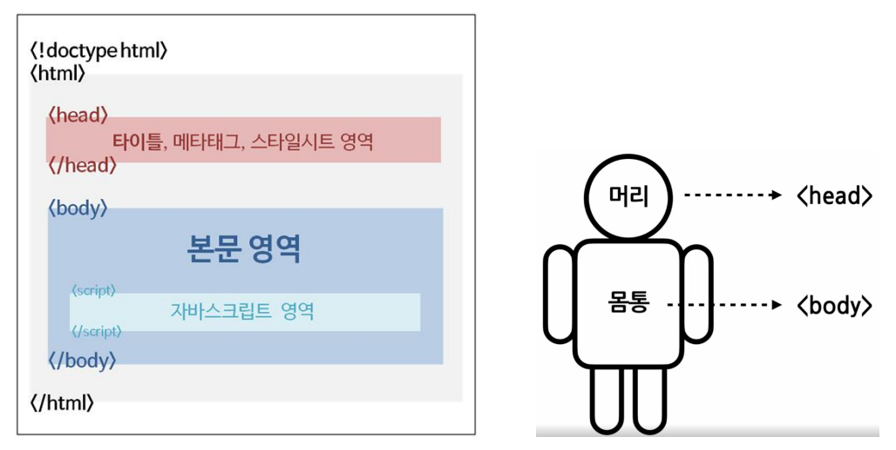
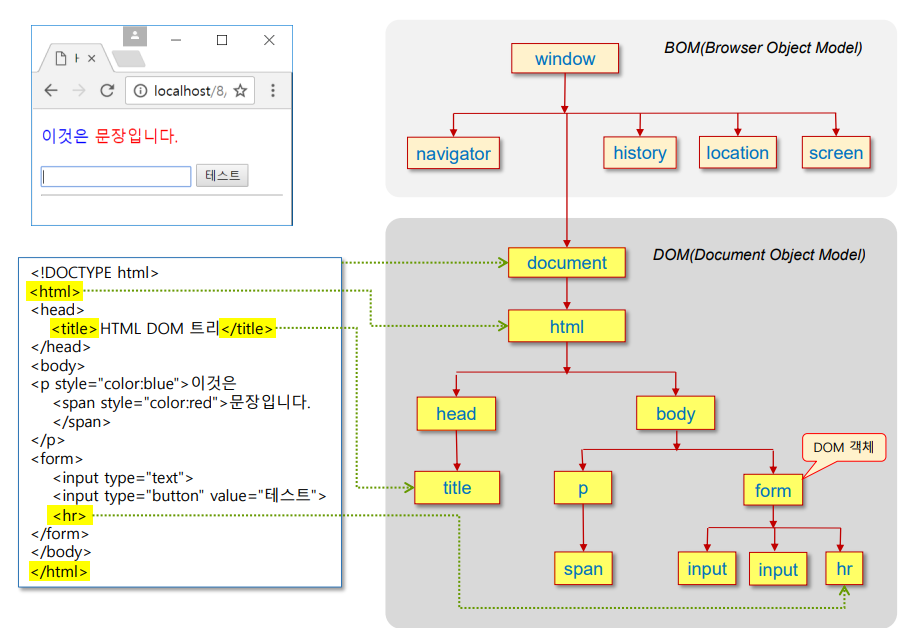
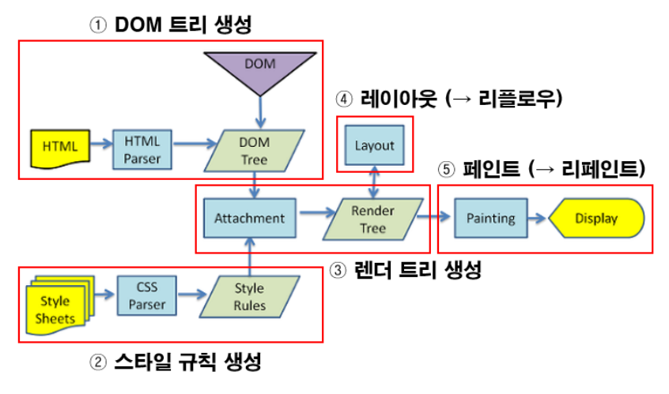
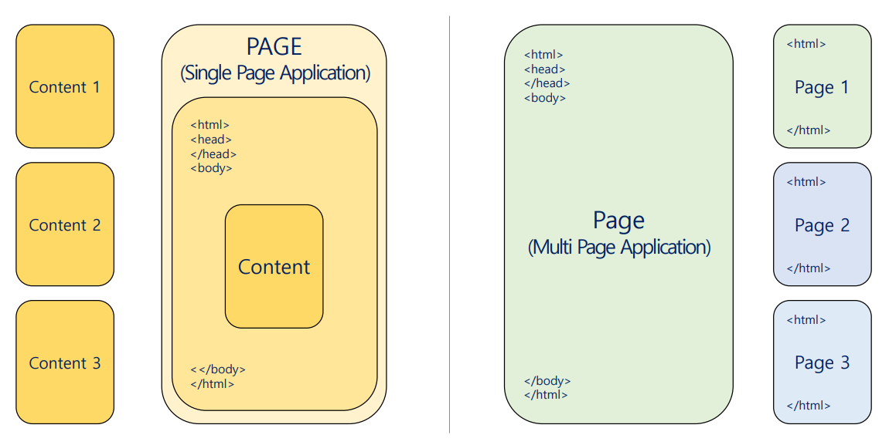
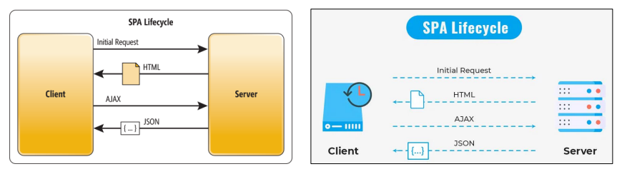
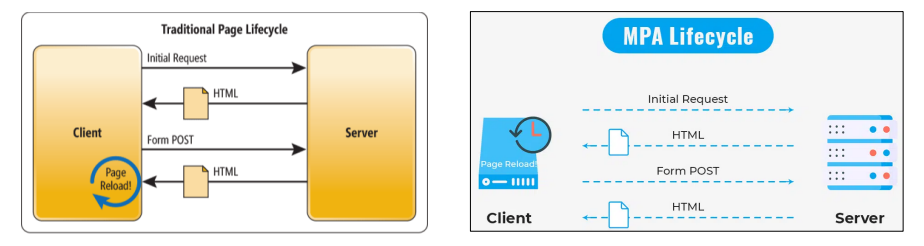

# HCJ, DOM, SPA & MPA
---
## ToC
- [HCJ](#hcj)
    - [HTML](#html)
    - [CSS](#css)
    - [Javascript](#javascript)
- [DOM](#dom)
- [Rendering](#rendering-렌더링)
- [SPA & MPA](#spa--mpa)
    - [SPA](#spasingle-page-application)
    - [MPA](#mpamulti-page-application)
- [Browser](#browser)

---
# HCJ
## HTML
### HTML의 정의
- 웹사이트의 모습을 기술하기 위한 마크업 언어
- Hyper Text Markup Language
	- Hyper Text
		- 참조(하이퍼링크)를 통해 한 문서에서 다른 문서로 즉시 접근할 수 있는 텍스트
	- Markup Language
		- 태그 등을 이용해 문서나 데이터의 구조를 명기하는 언어
		- 문서가 화면에 표시되는 형식을 나타내거나 데이터의 논리적인 구조를 명시하기 위한 규칙들을 정의한 언어의 일종
### HTML 문서 구조

## CSS
### CSS의 정의
- Style sheet 언어
	- CSS로 작성된 코드를 스타일 시트(style sheet)라고 부름
- HTML 문서의 색이나 모양 등 외관을 꾸미는 언어
	- HTML 문서의 요소들에 선택적으로 스타일을 적용함
- Cascading Style Sheet
	- Style
		- 문서를 장식하거나 정해진 양식에 맞게 내용을 다듬는 역할
	- Stylesheet
		- 문서의 스타일을 정의
		- 화면에 출력하기 위한 외형적인 모양과 형식에 관한 스타일 규칙들의 모임
		- 스타일 시트에 의해 웹 문서가 브라우저에 보여질 모습이 결정됨
### Sass
- CSS의 단점을 보완하기 위해 만든 CSS 전처리기

### CSS의 기능
- 색상, 배경, 텍스트, 폰트, 박스 모델(Box Model), 비주얼 포맷 및 효과 등
- 리스트, 테이블, 사용자 인터페이스 등

## Javascript
- 스크립트 언어
- 웹 페이지가 동작하는 것을 담당
- Ecma International의 프로토타입 기반의 프로그래밍 언어 (ECMAScript)

# DOM
Document Object Model

## HTML DOM (DOM)

### DOM을 사용하는 목적
- HTML 태그가 출력된 모양이나 콘텐츠 제어
- DOM 객체를 통한 각 태그의 CSS3 스타일 시트 접근 및 변경
- HTML 태그에 의해 출력된 텍스트나 이미지 변경

### DOM 트리
- HTML 태그의 포함 관계에 따라 DOM 객체의 트리(tree)가 생성됨

### DOM 객체
- HTML 태그 마다 하나의 DOM 객체 생성됨
	- (= DOM 노드(Node), DOM 엘리먼트(Element))

# Rendering (렌더링)
- 실시간으로 웹사이트가 그려지는 과정
## 렌더링 과정

- ① HTML을 파싱해 DOM 트리를 생성함
- ② CSS를 파싱해 CSSOM 트리를 생성함
- ③ DOM과 CSSOM을 결합해 렌더링 트리를 생성함
- ④ 렌더링 트리에서 각 노드의 크기와 위치를 계산함
- ⑤ 개별 노드를 화면에 그림(나타냄)

# SPA & MPA

## SPA(Single Page Application)

- 한 개의 페이지로 구성된 Application
- 모든 정적 리소스를 초기에 한 번 다운로드함
- 새로운 페이지 요청 시 필요한 데이터만 받아 갱신함
	- 현재 페이지를 동적으로 다시 작성함
		- 사용자와 소통하는 웹사이트
- 주로 CSR(Client Side Rendering)방식으로 렌더링
### 장점
- 변경되는 부분만 갱신함
	- 화면 깜빡임이 발생하지 않음
		- 반응형 디자인에 용이
		- 네이티브 앱과 유사한 사용자 경험 제공
- 서버에게 정적 리소스를 최초 한 번만 요청함
	- 받은 데이터는 전부캐시로 저장함
		- 로컬 스토리지를 효과적으로 캐싱 가능
		- 오프라인에서도 작동함
- 모바일 앱 개발에도 동일한 API 사용해 설계 가능
	- 백엔드 코드 재사용 가능
- FE와 BE의 구분이 뚜렷함
- 서버의 템플릿 연산을 클라이언트로 분산 가능
- 컴포넌트 별 개발에 용이
	- 재사용 가능
### 단점
- 데이터를 최초 로딩 시 한 번에 받아옴
	- 페이지 로딩시간이 긺
		- → Webpack code splition으로 해결 가능
- CSR 방식을 사용함
	- JS로 구축됨
- SEO에 대한 노출이 어려움
	- JS를 읽지 못하는 검색 엔진에 의한 크롤링이 되지 않아 색인이 안되는 문제가 발생할 수 있음
	- 비동기로 렌더링되는 페이지
		- → SSR, Next.js로 해결 가능
- 보안 문제
	- 쿠키 사용으로 인한 보안 취약점
		- 서버에서 세션으로 관리되는 SSR과 달리 CSR에서는 쿠키에 저장됨
	- XSS(교차 사이트 스크립팅)으로 인한 위험
		- 공격자가 다른 사용자의 웹 응용 프로그램에 클리언트 측 스크립트를 삽입하는 것
## MPA(Multi Page Application)

- 여러 개의 페이지들로 구성된 Application
- 새로운 페이지를 요청할 때마다 서버에서 렌더링된 정적리소스(HTML, CSS, JS)를 다운로드함
- 페이지를 이동·새로고침 시 전체 페이지를 다시 렌더링함
- SSR(Server Side Application)방식으로 렌더링
### 장점
- 짧은 초기 로딩시간
	- 서버로부터 완성된 형태의 HTML 파일을 전달받음
- 다중 페이지 생성 가능
	- 원하는 만큼의 페이지 추가 가능
	- 다양한 키워드를 타게팅 가능
		- 페이지 크롤링, 검색엔진 작동에 용이
		- SEO에 적합
			- 유저가 보는 화면 방식, 웹 크롤로가 보는 방식이 동일함
- 오랫 동안 사용되어와 안정적
	- 해결법, 프레임워크 등 다양한 자료가 존재
### 단점
- 새로운 페이지 요청 마다 전체 페이지를 렌더링함
	- 이동 시 (깜빡임)화면전환이 발생함
	- 페이지 로딩 시간 발생
	- 불필요한 템플릿의 중복 로딩 발생
	- 클라이언트가 JS파일을 모두 다운로드, 적용 전 까지 각 기능이 동작하지 않음
- 프론트와 백의 구분이 뚜렷하지 않음
	- 클라이언트 측과 서버 측 모두에 프레임워크를 사용해야함
- 많은 페이지
	- 유지 보수의 어려움
- 모바일 앱 개발시 추가적인 백엔드 작업 필요
	- 개발의 복잡성 증가

# Client - Server
- ### Client
	- 특정 서비스를 이용하는 사용자
	- ex) 웹 브라우저
- ### Server
	- 특정 서비스 제공자

# Browser
## Web browser
- (= 웹 브라우저, 인터넷 브라우저, 웹 탐색기)
- 월드와이드 웹(WWW)을 기반으로 인터넷의 콘텐츠에 접근하기 위한 응용 프로그램
	- HTML 문서, 그림, 멀티미디어, 파일 등
- 웹 서버에서 이동하며(naviage) 쌍방향으로 통신함
- HTML 문서나 파일을 출력하는 GUI 기반의 응용 SW
- 대표적인 HTTP 사용자 에이전트