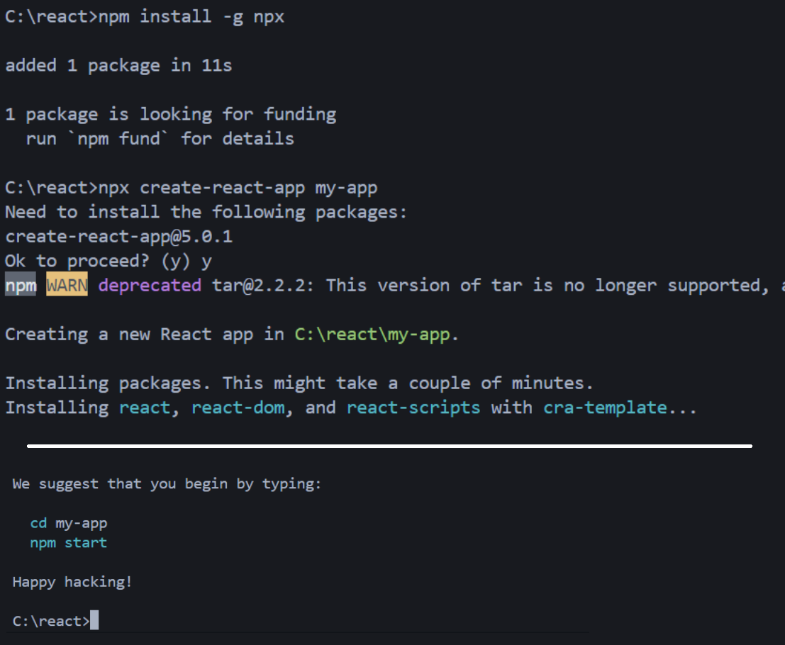

# React build 및 호스팅

## React의 특징
- Virtual DOM을 이용해 효율적이고 매끄로운 렌더링을 제공함

## React 설치 및 실행

### 1. node.js 설치
### 2. npx 설치
```shell
npm install -g npx
```
### 3. 새로운 리액트 프로젝트 생성
```shell
npx create-react-app my-app
```
### 4.가상 서버 실행
- 포트넘버: `3000`
```shell
npm start
```

## 리액트 디렉터리 구조
- `node_modules` : 필요한 모듈 및 라이브러리들의 모음
- `public` : 정적 파일들의 모음
- `src`
	- 리액트 프로젝트의 소스 코드가 포함된 주요 디렉터리
	- npm run build`를 통해 JS로 컴파일이 진행되고, `build`가 생성됨
- `package.json` : 모듈, 라이브러리들의 목록


## `homepage` 주소 설정
- package.json에 다음 내용을 추가함
```json
"homepage": ".",
```
- 애플리케이션의 홈페이지가 현재 호스팅되는 위치의 루트를 가리키게됨
- 프로젝트를 어디에 배포하든지 관계없이 항상 현재 URL을 기준으로 상대 경로를 계산하게됨

## build
- 배포 가능한 버전으로 생성하기
- webpack이 관여해 `build`디렉터리와 그 안의 정적 파일들을 생성함
```shell
npm run build
```

---
## 실습 결과물
[🔗 실습 결과물](https://seoftbh.github.io/24-1_React/week03/build/index.html)

