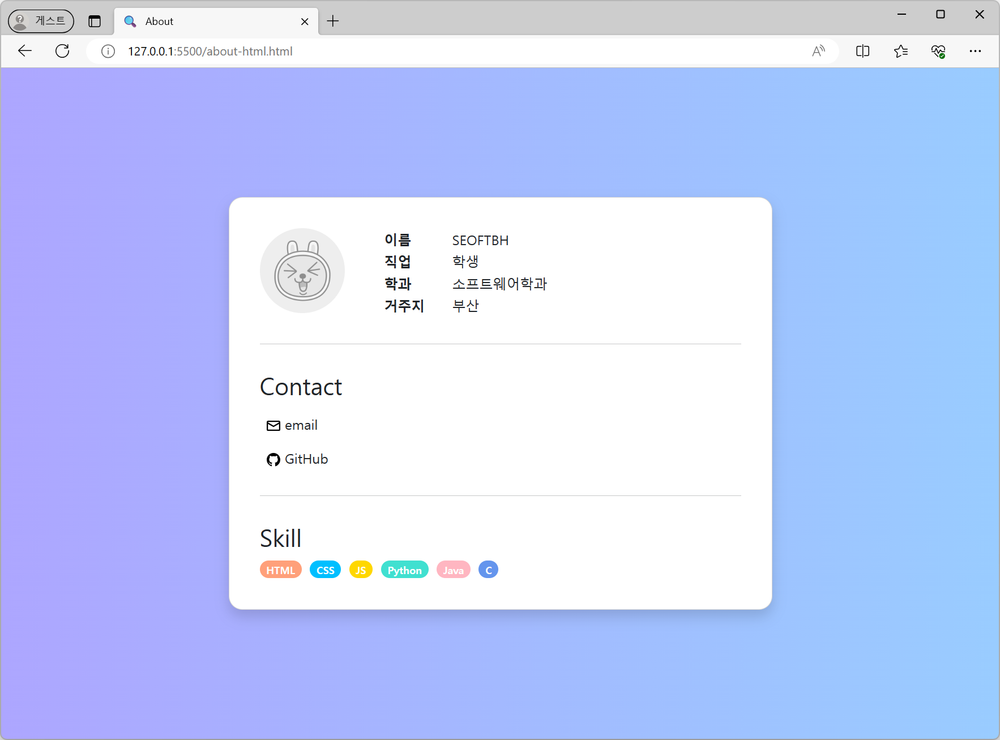

**ToC**
- [수업 내용 요약 & 실습](#수업-내용-요약)
- [과제](#과제)

---

# 수업 내용 요약
## JSX
- 확장된 JS 문법
	- 확장되었기 때문에 브라우저에서 바로 실행안됨
	- Babel을 전처리기로 사용해 JS로 변환함
- 하나의 파일 안에 JS와 HTML을 동시에 작성할 수 있게됨
	- cf) HTML안에 JS와 CSS를 넣는 것의 반대 개념
## JSX의 특징
### 주요 문법
- JS 표현식 사용이 가능함
- `if`문과 `for`문은 사용 안됨
	- 삼항 연산자는 허용됨
- 속성 정의에 카멜 표기법을 사용함
	- `-`기호는 없앰
	- 두 단어를 붙이고 뒷 단어의 첫 글자는 대문자로
	- ex) `background-color` → `backgroundColor`
- `class` 대신 `className`을 사용함
- 소문자로 시작하는 태그는 HTML 기본 엘리먼트
	- ex) `<div>`
- 대문자로 시작하면 사용자 정의 엘리먼트
	- ex) `<Book>`

### 주석
```
/* 주석 */
```


---

## 실습 1 - JSX 코드 작성해보기

1. 리액트 프로젝트 생성 `npx create-react-app book`
2. 생성된 프로젝트 안에서 `src` 디렉터리 하위에 `jsxCode`(소문자) 디렉터리를 생성함
3. `jsxCode` 디렉터리에 두 파일을 작성함
	- [`src/jsxCode/Book.jsx`](./book/src/jsxCode/Book.js)
	- [`src/jsxCode/BookLibrary.jsx`](./book/src/jsxCode/BookLibrary.js)
4. `index.js`에 다음의 import 문장을 추가함
```js
import BookLibrary from './jsxCode/BookLibrary';
```
5. `index.js`의 `root.render()`를 다음과 같이 수정함
```js
root.render(
  <React.StrictMode>
    <BookLibrary />
  </React.StrictMode>
);
```
6. `npm start`
### 실행결과
[🔗 Link](https://seoftbh.github.io/24-1_React/week04/book/build/index.html)


---
## React Elements Rendering

- React에서 Elements는 화면을 구성하는 가장 작은 단위
- 리액트는 데이터 변경이 필요한 부분만 업데이트함
- ReactDOM의 `render` 함수는 리액트 엘리먼트와 해당 되는 모든 자식 엘리먼트들을 DOM의 root node에 렌더링함


## 실습 2
### 2-1) JS로 구현하기 `clock.html`

#### 실행 결과
개발자 도구에서 `span`태그가 업데이트 되고 있다는 것을 보여주고 있음
변화되는 부분은 '초(second)'에 해당되는 부분이지만 시간 전체 부분을 업데이트하고 있음
즉 DOM 전체를 새로 만들고 있음

[🔗 Link](https://seoftbh.github.io/24-1_React/week04/clock/clock.html)


### 2-2) React로 구현하기 `reactClock.html`

#### 실행 결과
전체를 업데이트하지 않고
필요한 부분인 '초(second)' 부분만 업데이트 되고 있음
Virtual DOM을 사용하기 때문임

[🔗 Link](https://seoftbh.github.io/24-1_React/week04/clock/reactClock.html)


### 2-3) React로 구현하는 바이너리 시계 `binaryClock.html`
시계의 숫자를 2진수로 출력함
위에서부터 시, 분, 초

#### 실행 결과
DOM 전체가 아닌 변화가 일어나는 곳에만 업데이트가 발생하고 있음

[🔗 Link](https://seoftbh.github.io/24-1_React/week04/clock/binaryClock.html)


---
---

# 과제
## 과제 1 - 간단한 자기소개서 만들기
[🔗 Link](https://seoftbh.github.io/24-1_React/week04/report-aboutPage/about-html.html)

### 과제 1-1) HTML로 만들기
https://github.com/seoftbh/24-1_React/blob/d879bd792d51dfe6c64f76ac94180d7bc2c64578/week04/report-aboutPage/about-html.html#L15-L65

### 과제 1-2) JS로 구현하기
https://github.com/seoftbh/24-1_React/blob/d879bd792d51dfe6c64f76ac94180d7bc2c64578/week04/report-aboutPage/about-js.html#L18-L127

### 과제 1-3) JSX로 구현하기
https://github.com/seoftbh/24-1_React/blob/d879bd792d51dfe6c64f76ac94180d7bc2c64578/week04/report-aboutPage/about-jsx/About.js#L1-L62


## 과제 2 - Figma로 SPA(Single Page App) 기획하기
[🔗 Link](https://www.figma.com/proto/LVPd0Gyv26a39fy5Nsi3Nz/Untitled?node-id=1-3&starting-point-node-id=1%3A3&mode=design&t=MyJHVinETmfVw13U-1)
