# 컴포넌트
---
## ToC
- ### 컴포넌트
    - [컴포넌트의 정의](#컴포넌트의-정의)
    - [React 컴포넌트](#리액트-컴포넌트)
    - [실습 1-1) Function 컴포넌트 만들기](#실습-1-1-function-컴포넌트-만들기)
    - [Class 컴포넌트 만들기](#class-컴포넌트-만들기)
    - [실습 1-2) Class 컴포넌트 만들기](#실습-1-2-class-컴포넌트-만들기)
- ### props
    - [props의 정의](#props-속성-프로퍼티-properties)
    - [실습 2 - 프로퍼티로 값 넘기기](#실습-2---프로퍼티로-값-넘기기)
    - [프로퍼티 종류](#프로퍼티-종류)
    - [이미지, 텍스트 출력](#이미지-텍스트-출력)
    - [실습 3 - 이미지와 텍스트를 출력하는 컴포넌트](#실습-3---이미지와-텍스트를-출력하는-컴포넌트)
- ### [과제](#과제)

---
## 컴포넌트의 정의
### 컴포넌트
- 입력을 받아 출력하는 역할
	- 함수와 비슷한 역할
		- JS의 함수처럼 동작해 React element를 반환함
	- 입력으로 props
	- 출력으로 Element
	- "Components are like functions that return HTML elements." -W3Schools-
- 재사용이 가능한 각각의 독립된 모듈
	- 컴포넌트들을 조합해 새로운 컴포넌트를 구성할 수 있음
		- 컴포넌트 안에 다른 컴포넌트가 중첩됨
	- "웹 페이지를 만드는 퍼즐 조각"
		- UI 조각인 컴포넌트를 모아 전체 퍼즐 그림인 웹 페이지를 만들 수 있음
- 어떤 데이터 집합을 사용하든 같은 컴포넌트를 사용하면 모두 동일한 DOM 구조가 반환됨
### 리액트의 특징
- Component 기반의 구조를 가짐
- 모든 페이지가 Component로 구성됨
- 컴포넌트들로 화면이 구성됨

> 요즘 추세로는
> HTML에는 div 태그와 root만 작성하고
> 나머지는 컴포넌트를 이용해 렌더링함

---
## React 컴포넌트
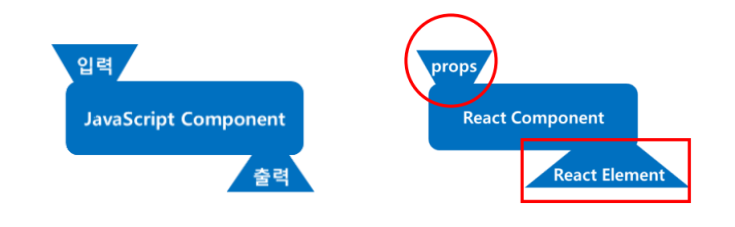

### JS 컴포넌트와 React 컴포넌트
- JS 컴포넌트
	- 함수 형태
		- 입력에 따라 출력됨
- React 컴포넌트
	- 입력과 출력이 정해져 있음
		- 입력으로는 props(속성)
		- 출력으로는 React Element

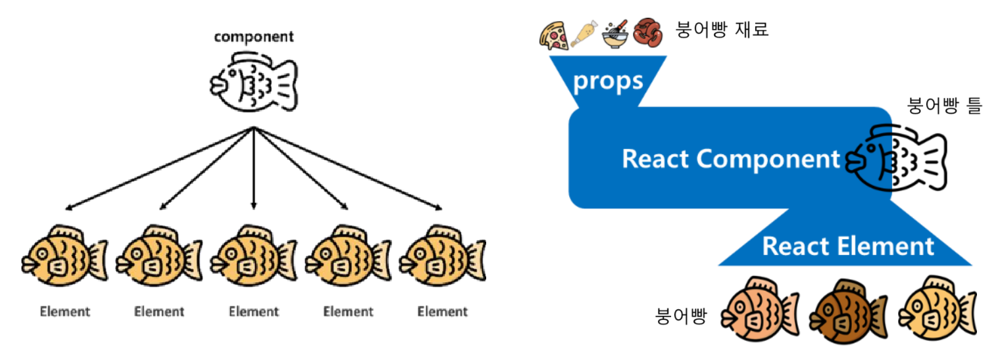
> "같은 붕어빵이라도 넣는 재료에 따라 다른 맛이 난다."

### 리액트 컴포넌트
- 어떠한 속성들을 입력받고, 그에 맞는 React Element를 생성해 리턴해주는 역할
- ==입력은 props, 출력은 React Element==
### props
- 리액트 컴포넌트의 속성
- 컴포넌트의 입력으로 들어감
- 같은 React Component에서 속성(색상, 크기 등)을 바꿀 때 사용되는 컴포넌트의 "속 재료"에 해당
- 'property' : 재산, 속성, 특성

### React Element(리액트 엘리먼트)
- 리액트 앱을 구성하는 가장 작은 빌딩 블록들
- 컴포넌트들로 구성됨
- JS 객체 형태로 존재하며, 화면에 보이는 것을 기술함

> react element는 커포넌트들로 구성됨
> 최종적으로는 html로 바뀜

> 객체지향의 클래스 개념에 해당

---

## 리액트 컴포넌트의 구성
리액트에서 컴포넌트는 2가지로 나뉨
- Component
	- **Class Component**
	- **Function Component**
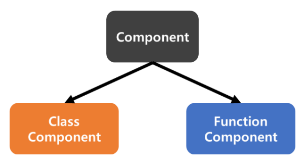

### Function Component
- pure 함수 같은 역할을 해야함
	- 컴포넌트를 일종의 함수처럼 사용
	- 컴포넌트에서 props의 내용을 변경 못함
- 코드가 간단하다는 장점

#### 예)
```js
function Welcome(props){
	return <h1>안녕, {props.name}</h1>;
}
```
- 하나의 props객체를 받아 인사말이 담긴 React element를 리턴함
- (DOM Element)

> 요즘은 class component보다 function component 많이 사용하는 추세

### Class Component
- Javascript ES6의 `class`를 이용해 만들어진 Component
- Function Component에 비해 몇 가지 추가 기능을 가짐
#### 예)
```js
class Welcome extends React.Component{
	render(){
		return <h1>안녕, {this.props.name}</h1>;
	}
}
```
- Function Component를 Class Component로 만든 예제
- `React.Component`를 상속받음


---

> 컴포넌트 입력은 props
> 출력은 react element
> react element는 결국 dom의 element
> dom의 element는 결국 html 태그


---
## Component 이름 규칙
Component name
- ==항상 대문자로 시작==
	- 소문자로 시작하면 React에서 Component가 아닌 DOM 태그로 인식하기 때문
		- 리액트 DOM 태그 목록:  [React DOM 컴포넌트 – React](https://ko.react.dev/reference/react-dom/components)
- 카멜케이스 사용

> DOM 태그 ⇒ HTML 태그

> 소문자는 DOM tag (HTML 태그) (DOM element)
>
> 대문자는 사용자 정의 컴포넌트

## Function 컴포넌트 만들기

### 리액트 프로젝트 이름 규칙
- ==모두 소문자로==
- 대문자 사용 금지
- 공백, 특수문자 금지
	- 단, `-`(하이픈), `_`(언더스코어)는 예외
- 예)
	- 🚫 `MyApp`
	- ✅ `my-app`

```shell
npx create-react-app comp
```


### `rfc` 스니펫 자동완성
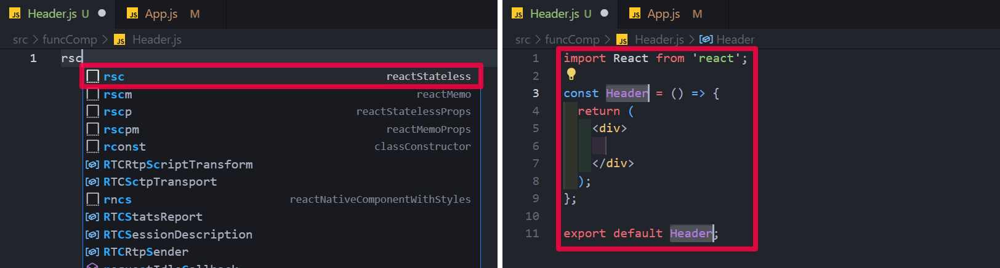

### 다른 JS파일에서 불러올 수 있도록 내보내기
외부에서 쓸 수 있게 하기 위함
- `export default Header;` (하단에 위치)
- 또는 `export default function Header() {}` (상단에 위치)
	- `function` 앞에 붙이는 방법

### 자동 완성으로 import 추가하기
컴포넌트를 사용하기 위해서는 import를 해줘야함
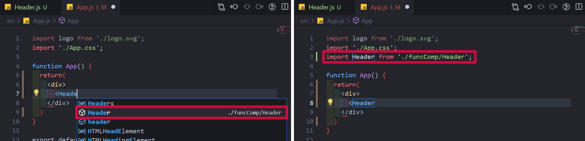

## 실습 1-1) Function 컴포넌트 만들기
- HTML 태그를 포함한 컴포넌트들을 만듦
- 컴포넌트들을 컴포넌트에 조합해서 실행함
	- `App.js`안에 `Header.js`, `Footer.js`, `Main.js` 포함됨
- 사용자 정의 컴포넌트는 파일명이 대문자로 시작해야함
- 컴포넌트는 JS로 만들어졌음
- 리액트 컴포넌트가 JS 또는 JSX를 찾아서 생성함
#### 실행결과
[🔗 Link
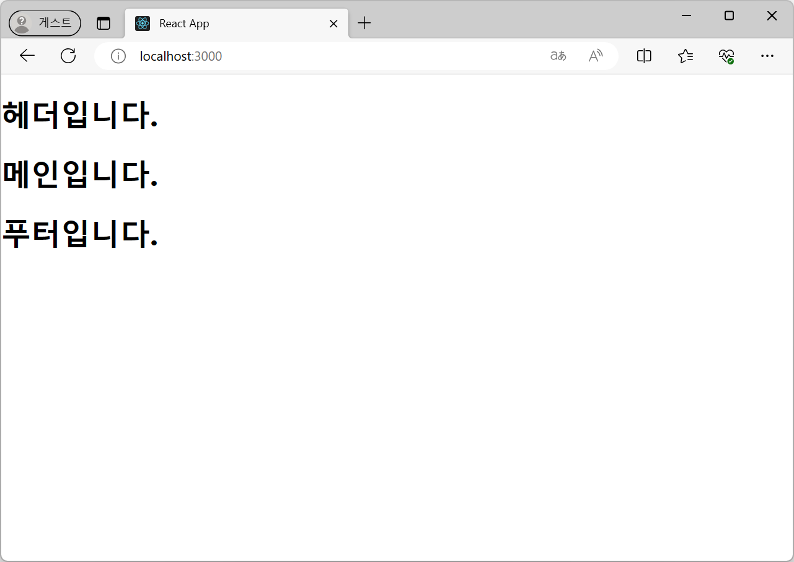](https://seoftbh.github.io/24-1_React/week05/comp/build/build-funcComp/)


#### 디렉터리 구조
- comp
	- src
		- funcComp
			- `Footer.js`
			- `Header.js`
			- `Main.js`
		- `App.js`
#### 코드
```js title:"src/App.js"
import './App.css';
import Header from './funcComp/Header';
import Main from './funcComp/Main';
import Footer from './funcComp/Footer';

function App() {
  return(
    <div>
      <Header />
      <Main />
      <Footer />
    </div>
  )
}

export default App;

```

```js title:"src/funcComp/Header.js"
import React from 'react'

export default function Header() {
  return (
    <div>
      <header>
        <h1>헤더입니다.</h1>
      </header>
    </div>
  )
}

```

#### 참고) `app.js`대신 `index.js`에 다음과 같이 추가하는 방법도 있음
```
<React.StrictMode>
	<Header />
	...
```

---

> 컴포넌트는 재사용 위함

> header.js를 js로 html 태그들 만들게 하거나
>
> 아니면 header.js예제처럼 만드냐
> 
> 여러 방법이 있음

> 컴포넌트 중심으로 구성
>
> 컴포넌트는 최종적으로 html elment, 즉 html 태그

---

## Class 컴포넌트 만들기
### `rcc` 스니펫 자동완성
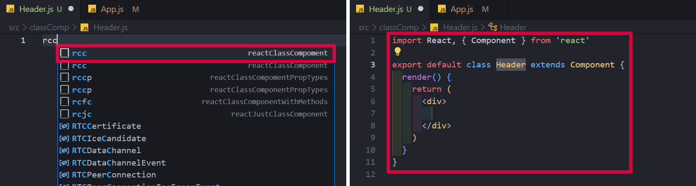

## 실습 1-2) Class 컴포넌트 만들기
#### 실행 결과
[🔗 Link
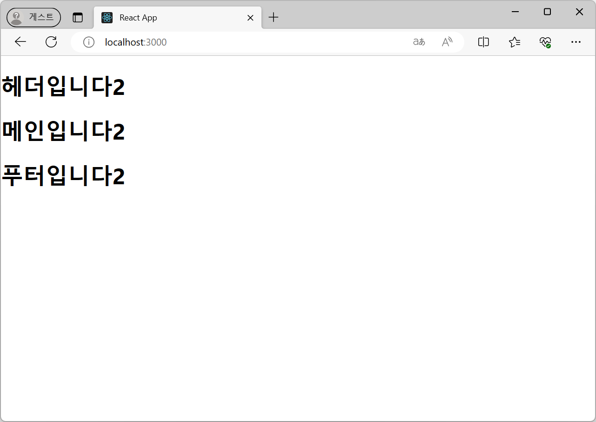](https://seoftbh.github.io/24-1_React/week05/comp/build/build-classComp/)


#### 디렉터리 구조
- comp
	- src
		- classComp
			- `Footer.js`
			- `Header.js`
			- `Main.js`
		- `App.js`
#### 코드
```js title:"src/App.js"
import './App.css';
import Header from './classComp/Header';
import Main from './classComp/Main';
import Footer from './classComp/Footer';

function App() {
  return(
    <div>
      <Header />
      <Main />
      <Footer />
    </div>
  )
}

export default App;

```

```js title:"src/classComp/Header.js"
import React, { Component } from 'react'

export default class Header extends Component {
  render() {
    return (
      <div>
        <header>
            <h1>
                헤더입니다2
            </h1>
        </header>
      </div>
    )
  }
}

```

---

> react 16 이상부터 펑션 컴포넌트 밀어줌
> 그러나 버전 18에서 많이 deprecated 됨

---
## props (속성, 프로퍼티, properties)
- React 컴포넌트는 props를 이용해 통신함
- **상위 컴포넌트가 하위컴포넌트에** 값을 전달할 때 사용함
	- (부모 컴포넌트 → 자식 컴포넌트)
- **단방향 데이터 흐름**을 가짐
- 수정할 수 없다는 특징 가짐
	- 하위 프로퍼티 입장에서는 **읽기 전용** 데이터

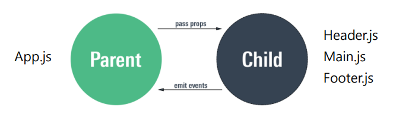
>상위 컴포넌트가 하위 컴포넌트를 품은 형태

>pure function 개념

### props가 사용되는 사이트의 예 - Airbnb

- 모든 요소들이 컴포넌트로 구성됨
- 같은 컴포넌트의 값만 다름
	- 예를 들어 시골(Contry) 컴포넌트에 이미지, 주소, 가격 정보를
	  상위 컴포넌트가 하위컴포넌트에게 전달해 표현함

---


## 실습 2 - 프로퍼티로 값 넘기기
- props를 가져와 컴포넌트를 만듦
- `<MyComponent name="HTML" />`
	- `name="HTML"` 부분이 props를 설정하는 부분
	- `name`이라는 props를 지저암
	- 값으로 `HTML`을 부여함
- `App.js`는 `MyComponent.js`를 불러오는 부모(상위) 컴포넌트임

#### 실행 결과
[🔗 Link
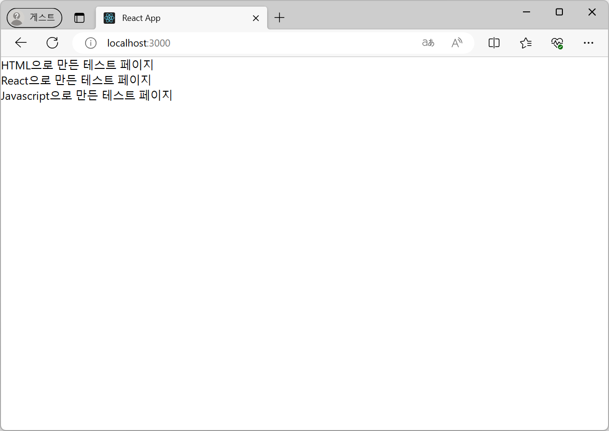](https://seoftbh.github.io/24-1_React/week05/comp/build/)

#### 디렉터리 구조
- comp
	- src
		- `App.js`
		- `MyComponent.js`

#### 코드
```js title:"src/App.js"
import './App.css';
import MyComponent from './MyComponent';

function App(props) {
  return(
    <div>
      <MyComponent name="HTML" />
      <MyComponent name="React" />
      <MyComponent name="Javascript" />
    </div>
  )
}

export default App;

```

```js title:"src/MyComponent.js"
import React from 'react'

export default function MyComponent(props) {
  return (
    <div>
        <div>
            {props.name}으로 만든 테스트 페이지
        </div>
    </div>
  )
}

```

> [!warning] 
> 작성 시 주의사항
>
> - import 추가하기
> - 파라미터로 `props` 추가하기

---

> [!note] 
> **컴포넌트의 입출력**
> - 입력은 props
> - 출력은 Elements

> [!note]
> **컴포넌트의 정의**
> - 페이지를 구성하는 모든게 컴포넌트
> - HTML 컴포넌트 ⇒ HTML 태그 (DOM 요소 구성하는 엘리먼트)
> - 사용자가 만들 수 있는 태그는 → **대문자**로 작성
> - 컴포넌트는 다른 **컴포넌트를 포함**할 수 있음


> [!note] 
> **props 정의**
> - props는 상위 컴포넌트에서 하위 컴포넌트로 전달하는 정보(값) → **단방향**
> - 전달 받은 값 반영해 **하나의 컴포넌트**로 **서로 다른 엘리먼트를 리턴**(출력)시킬 수 있음


> comp 자체에서 값을 가지거나 처리는
> → 다음주의 stack?

---
## 프로퍼티 종류
### 1 개의 프로퍼티 넘기기
#### 예)
```js title:"App.js"
...
<Main name="홍길동"/>
...
```

```js title:"Main.js"
...
function Main(props) {
...
<h1>안녕하세요. {props.name} 입니다.</h1>
...
```

### 2개의 프로퍼티 넘기기
#### 예)
```js title:"App.js"
...
<Main name="홍길동" color="blue"/>
...
```

```js title:"Main.js"
...
function Main(props) {
...
<h1 style={{color: props.color}}>안녕하세요. {props.name} 입니다.</h1>
...
```

- 태그의 스타일 지정에 중괄호가 이중으로 사용됨 (`{{ }}`)
- 스타일 태그의 중괄호에 props 지정을 위한 중괄호가 덧씌워진 형태
	- props 지정 위해 js 표현식 사용해야함
- 값 지정에는 콜론(`:`)을 사용함
#### 참고) `props`키워드 생략 가능
- `props` 키워드 생략 가능하나 코드 유지 · 관리에 어려울 수도 있음
```js title:"Main.js"
...
function Main({name, color}) {  // <- 파라미터 부분도 달라졌음!!
...
<h1 style={{color}}>안녕하세요. {name} 입니다.</h1>
...
```


### 숫자 프로퍼티 넘기기
- 문자는 **큰따옴표**(`" "`) 사용
- 그 외(숫자 등)에는 **중괄호**(`{ }`) 사용
```js title:"App.js"
...
<Main name={9} color="blue"/>  // 숫자 9, 문자열 blue
...
```

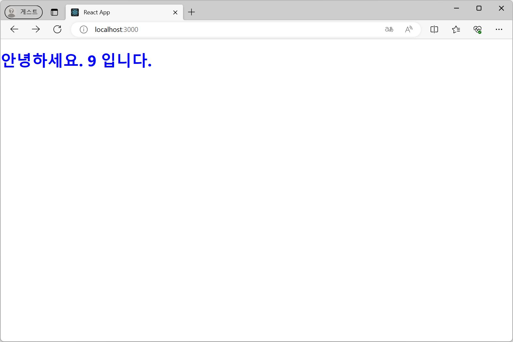

---
### 프로퍼티 자료형(타입) 정의
- 프로퍼티의 자료형을 미리 선언 가능함
- 리액트 엔진이 값을 전달 할 때 효율적, 버그 예방에 도움
- 리액트에서 제공하는 `prop-types` 사용해 자료형 선언
#### 예)
```js title:"Main.js"
...
import PropTypes from 'prop-types' // 프로퍼티의 타입 지정 위해 사용됨
...
<h1 style={{color}}>안녕하세요. {name} 입니다.</h1>
...
// 프로퍼티 타입 지정
Main.propTypes = {
	name: PropTypes.string
}
...
```
- `name: PropTypes.string`
	- name을 문자열로 전달받아 처리하겠다는 것

### 프로퍼티 기본값 설정
- 프로퍼티가 지정되지 않은 경우 설정된 기본값이 사용됨
#### 예)
- name 프로퍼티가 없는 경우
- 기본값으로 설정된 '디폴트'가 출력됨
```js title:"App.js"
...
<Main color="blue"/>  // name="홍길동"이 입력되지 않은 상황
...
```

```js title:"Main.js"
...
import PropTypes from 'prop-types' // 프로퍼티의 타입 지정 위해 사용됨
...
<h1 style={{color: props.color}}>안녕하세요. {props.name} 입니다.</h1>
...
// 프로퍼티 기본값 지정
Main.defaultProps = {
	name: '디폴트'
}
...
```

> 좌측 박스는 `Main.js`
> 우측 박스는 `App.js`
> 마지막 export 라인 참고


---

> (컴퓨터에서의) require, optional
> 보통, require는 정확히 명시되고,
> optionl은 생략됨(언급하지 않음)

---
### 프로퍼티의 필수값 설정
- 디폴트 설정을 하지 않는 경우 해당 프로퍼티를 필수 프로퍼티로 선언 할 수도 있음
- `isRequired` 키워드를 사용해 필수값 설정
- 필수적으로 전달해야하는 값에 지정
```js title:"Main.js"
...
import PropTypes from 'prop-types' // 프로퍼티의 타입 지정 위해 사용됨
...
<h1 style={{color: props.color}}>안녕하세요. {props.name} 입니다.</h1>
...
// 프로퍼티 기본값 지정
Main.propTypes = {
	name: PropTypes.string.isRequired,
}
...
```

---

### 불리언 프로퍼티
- `true`, `false`만 정의 가능한 자료형
- **중괄호 없이** 프로퍼티 이름만 선언함
- 상위 컴포넌트에서 불리언 프로퍼티를 생략할 경우 `false`로 처리됨
	- 예) `<Main name="홍길동" color="blue"/>` → `false`로 처리됨
	- (props는 상위 컴포넌트가 하위 컴포넌트로 전달하는 데이터)
- 삼항 연산자가 사용되었음
	- jsx에서는 if, for문 사용 불가함
```js title:"App.js"
...
<Main name="홍길동" color="blue" maleYn/>  // 불리언 프로퍼티 maleYn
...
```

```js title:"Main.js"
...
const msg = maleYn ? '남자' : '여자';  // 불리언 사용
...
<h1 style={{color: props.color}}>안녕하세요. {{msg}} 입니다.</h1>
...
```

---

### `props.children` 활용하기
- `children` 사용해 내부에 있는 내용을 표현할 수 있음
- `{props.children}`
- 하위 컴포넌트를 포함 시킬 때 사용

```js title:"Wrapper.js"
import React from 'react'

function Wrapper(props) {
    const style = {
        backgroundColor: 'yellow',
    };

  return (
    <div style = {style}>
        {props.children}
    </div>
  );
}

export default Wrapper
```

```js title:"App.js"
import Main from './Main';
import Wrapper from './Wrapper';

function App() {
  return (
    <div>
      <Wrapper>
        <Main name="메인" color="blue"/>
      </Wrapper>
    </div>
  );
}

export default App;
```

```js title:"Main.js"
...
<h1 style={{color}}>안녕하세요. {name} 입니다.</h1>
...
```
#### 실행 결과
- 좌측 - 위 코드를 실행한 결과 (Main이 표시됨)
- 우측 - `{props.children}`를 생략한 결과 (Main이 표시되지 않음)
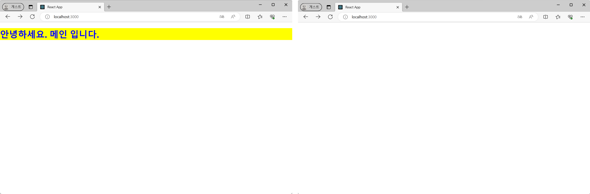

---


## 이미지, 텍스트 출력
> [!warning] 
> `index.html`은 public 폴더에 있으므로 이미지도 public 폴더 안에 넣어야함
>
> public 은 정적인 데이터를 넣는 곳
> cf) src 폴더에는 `asset`폴더를 만들어 사용함

> [!note]
> 컴포넌트는 페이지를 구성하는 조각
>
> 컴포넌트를 하나만 사용했음
>
> props에 의해 하위에 생성되는 컴포넌트가 달라질 수 있음
## 실습 3 - 이미지와 텍스트를 출력하는 컴포넌트
- 아이콘 이미지 출처:  [iconfinder](https://www.iconfinder.com/)
- `npx create-react-app textimg`
#### 실행 결과
[🔗 Link
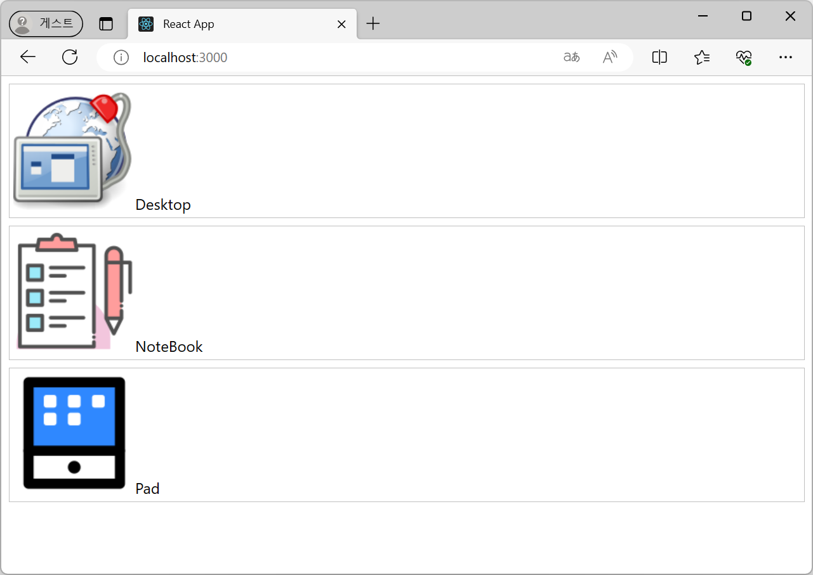](https://seoftbh.github.io/24-1_React/week05/textimg/build/)

#### 디렉터리 구조
- textimg
	- public
		- img
			- `desktop.png`
			- `notebook.png`
			- `pad.png`
	- src
		- `App.js`
		- `FPhotoText.js`
#### 코드
```js title:"src/App.js"
import logo from './logo.svg';
import './App.css';
import FPhotoText from './FPhotoText'

function App() {
  return (
    <div>
      <FPhotoText image="desktop" label = "Desktop" />
      <FPhotoText image="notebook" label = "NoteBook" />
      <FPhotoText image="pad" label = "Pad" />
    </div>
  );
}

export default App;

```

```js title:"src/FPhotoText.js"
import React from 'react';
function FPhotoText(props) {
    const url = "img/"+ props.image + ".png"
    const label = props.label
    const boxStyle = {
        border: "1px solid silver",
        margin: "8px",
        padding: "4px"
    }
    return (
        <div style={boxStyle}>
        
        <span>{label}</span>
        </div>
    );
}
export default FPhotoText;
```

---
---

## 과제
- 웹사이트를 5개 이상의 컴포넌트로 구성하세요.
- 2개 이상의 props를 전달하는 컴포넌트를 하나 이상 포함하세요.

### 기획
- 유용한 사이트를 추천하는 웹페이지 만들기

[🔗 Link
](https://www.figma.com/proto/Nn3Mssid1PyBfce0S03QMP/Five-Component-React-App?node-id=2-2&mode=design&t=Ict9o6wdggITiCQZ-1)

### 구현
#### 컴포넌트 구조
-`App.js`
    - `Header.js`: 제목 및 네비게이션바
        - `NavBar.js`: 네비게이션바
            - `NavChip.js`: 네비게이션바 내부 버튼
    - `Main.js`: 메인
        - `Card.js`: 카드 - 이미지, 제목, 설명

#### props 구현
- `NavChip.js`
- `Card.js`

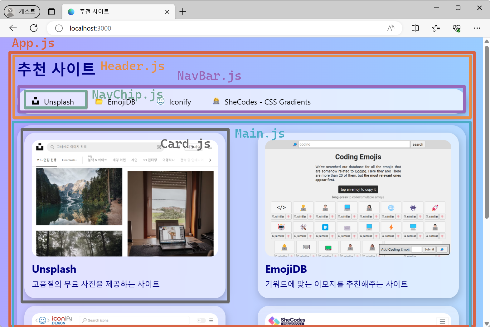

### 데모
[🔗 Link
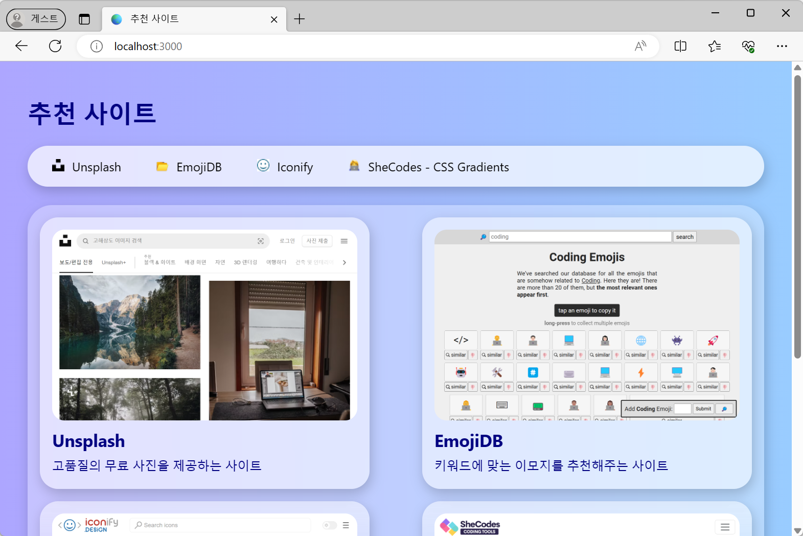


](https://seoftbh.github.io/24-1_React/week05/five_component/build/)


