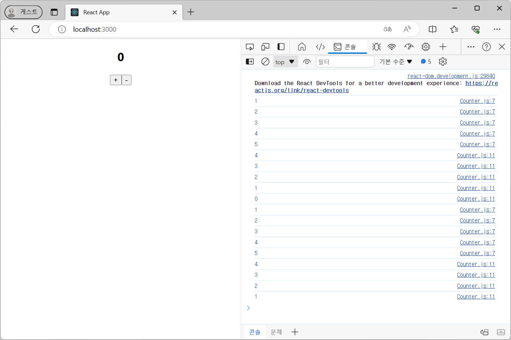
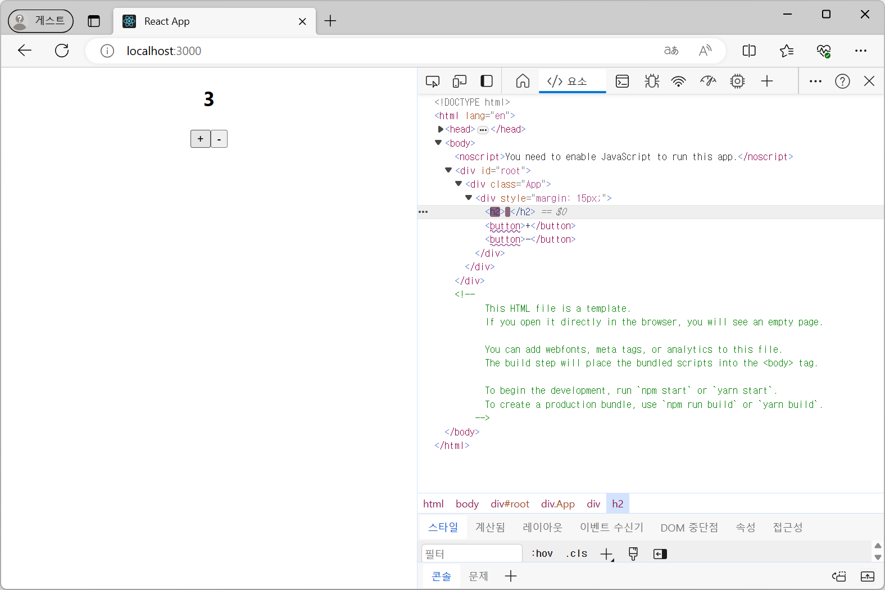
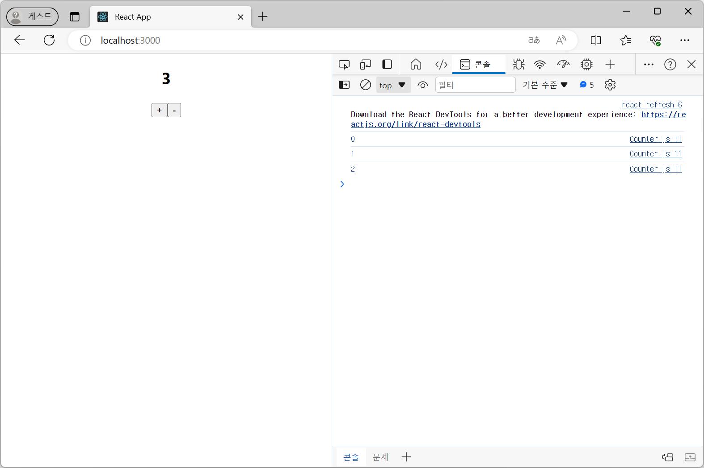
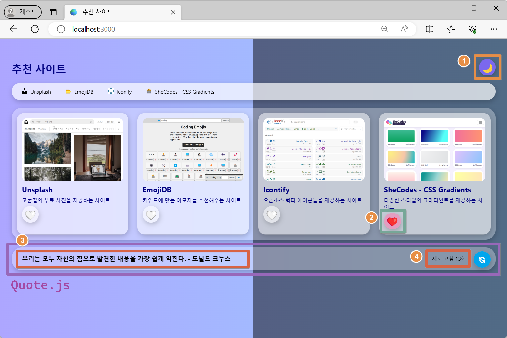
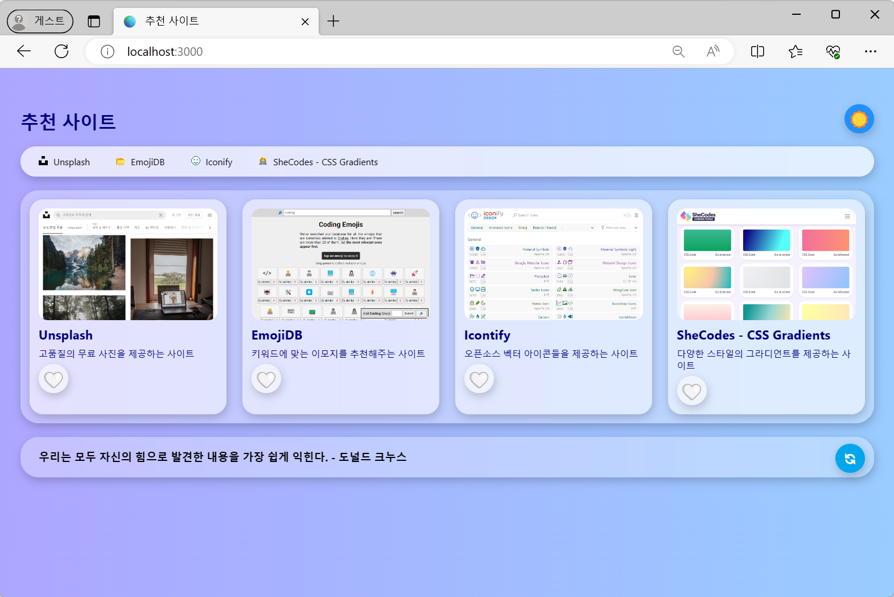
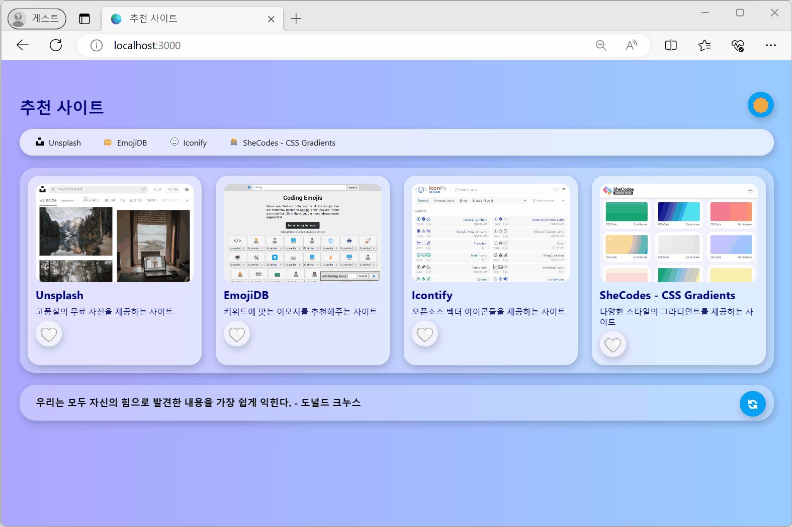
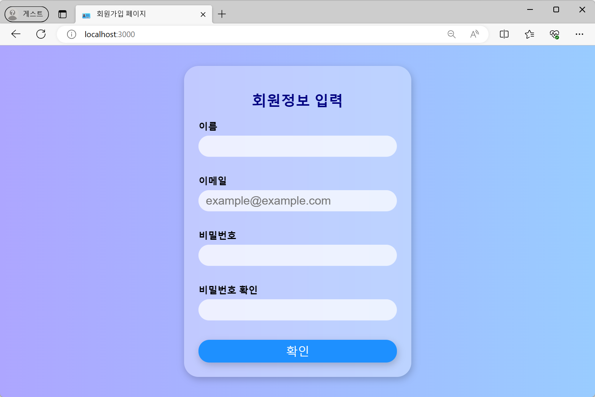
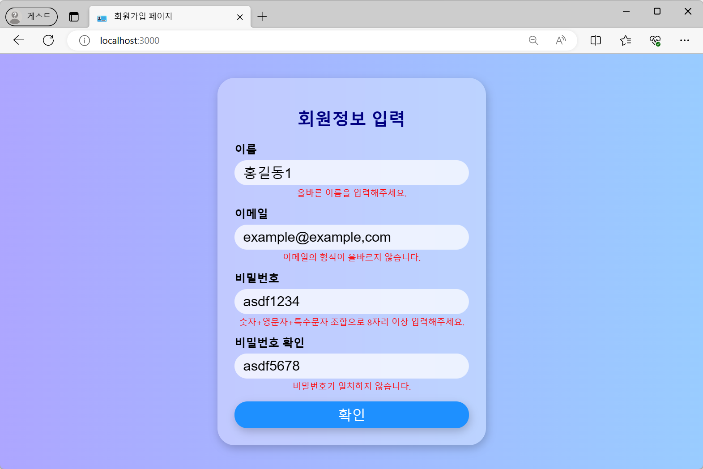
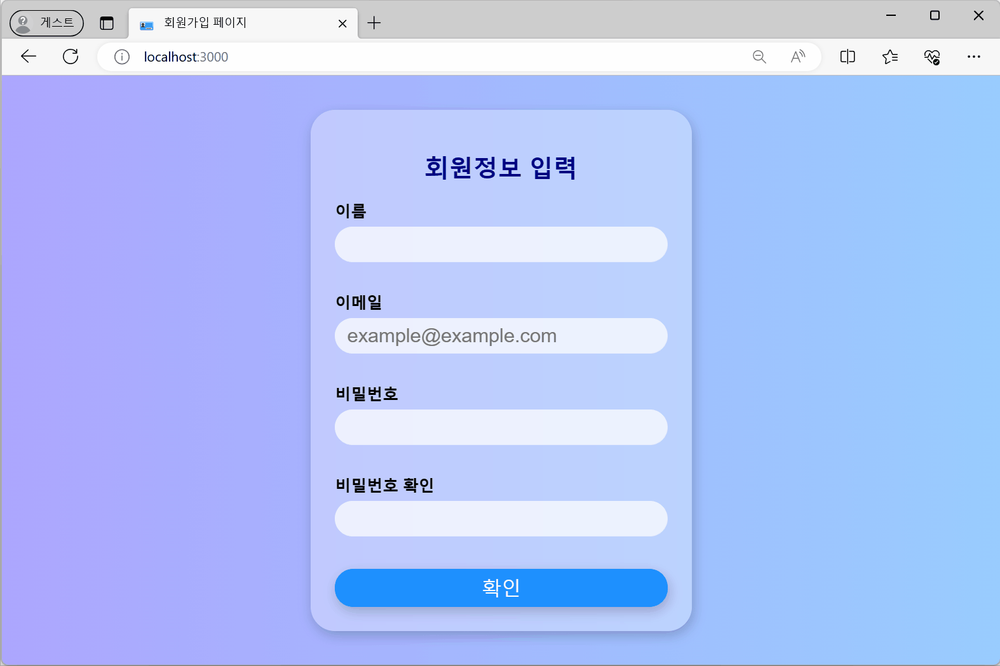

# Component State
---
## ToC
- [상태(state)](#상태state)
    - [실습 - 일반 변수와 state 비교](#실습---일반-변수와-state-사용)
    - [실습 - 비동기](#실습---비동기)
    - [state의 종류](#상태state의-종류)
    - [state 생성 및 사용](#state-생성)
    - [Event Handling](#event-handling)
- [순수 함수 & 비순수 함수](#순수-함수--비순수-함수)
- [람다 함수 & 화살표 함수](#람다-함수--화살표-함수)
- [과제 1 - state 컴포넌트](#과제-1)
- [과제 2 - 회원가입 페이지](#과제-2)

---
---
## 상태(state)
- ### 정의
	- "변수"
		- 마치 함수에 선언된 모든 변수처럼, 컴포넌트에서 관리됨
		- JS의 변수 ≈ React의 state
		- 컴포넌트의 메모리
	- "상태"
		- React Component의 상태를 의미
		- '정상', '비정상'의 의미 보다, "컴포넌트의 데이터"를 의미
	- 리액트 컴포넌트 내부에서 관리되는 변경 가능한 데이터
		- 값을 저장하거나 변경할 수 있는 개체
		- 시간이 지남에 따라 변하는 데이터
	- 렌더링 결과물에 영향을 주는 정보
		- state 값이 변경된 경우 → React가 자동으로 계산해 변경된 부분을 렌더링함
	- 컴포넌트의 현재 상황에 대한 정보를 나타내기 위해 리액트에서 쓰는 일반 자바스크립트 객체
- ### 특징
	- 보통 이벤트와 함께 사용됨
	- 컴포넌트 내 지속적으로 변경이 일어나는 값 관리 위해 사용됨
		- 개발자가 의도한 동작에 의해, 사용자의 입력에 의해 값이 변경될 수 있음
	- 모든 컴포넌트에 state 추가 및 업데이트 가능
	- #### `props`(프로퍼티)와의 차이점
		- props는 단방향으로(상위에서 하위로) 전달되는 속성
		- state는 컴포넌트 자체가 가질 수 있는 값
		- 컴포넌트 내부에서 값을 변경할 수 있음
		- 자동으로 생성되지 않아 명시적으로 `state`를 기술해야 함
	- #### `cosnt`, `let` 등의 변수와 차이점
		- 값이 변하면 관련있는 컴포넌트들이 재렌더링되어 화면이 바뀌게됨
- ### 사용 시 주의사항
	- 렌더링과 데이터 흐름에 사용되는 것만 state에 사용해야함
		- state가 변경되면 Component가 재렌더링되기 때문
		- 불필요하게 사용되면 재렌더링으로 성능 저하로 이어짐

---

## State를 사용하는 이유
- 변수와 달리 변경되면 자동으로 화면이 변경됨(재렌더링)
	- 값이 변경되었을 때 화면에 반영되도록 연결된 것

## setState의 특징
- **비동기적**으로 작동함
- 이벤트 핸들러가 닫히는 시점에 setState를 종합해 한 번에 처리함
- state도 결국 객체
	- 같은 키 값 가진 경우, 마지막에 실행한 값으로 덮어씌워짐
### 비동기적으로 동작하는 이유
- state 값이 변경되면 리렌더링이 발생하는데
- 변경되는 state 많을 수록 많은 리렌더링 발생
- → 속도, 성능 저하 발생
- 따라서, 16ms 동안 변경된 상태 값들을 모아서 한 번에 리렌더링을 진행함
	- ⇒ batch(일괄) update

> [!note] 
> ### 동기와 비동기
> - 동기(Synchronous: 동시에 발생하는)
> 	- 요청에 대한 응답을 받아야 다음 동작이 이루어짐
> 	- 순차적으로 실행됨
> 		- 작업을 수행 중이라면 다음 작업은 대기해야함
> 		- 블로킹(작업 중단)이 발생함
> 		- 실행 순서가 보장됨
> - 비동기(Asynchronous: 동시에 발생하지 않는)
> 	- 작업 종료 여부에 관계 없이 다음 작업을 실행함
> 		- **동기** 방식과 달리 실행 순서를 보장하지 않음
> 		- 블로킹이 발생하지 않음


---
## 실습 - 일반 변수와 state 사용
### 일반 변수를 사용한 경우
#### 실행 결과
- 콘솔에는 출력되지만, 화면은 변경되지 않음

[🔗 Link

](https://seoftbh.github.io/24-1_React/week06/statetest/build-regular_var/)

#### 코드
```js title:"statetest/src/Counter.js"
import React from "react";

export default function Counter() {
  let count = 0;
  const plus = () => {
    count = count + 1;
    console.log(count); // 제대로 증가함
  };
  const minus = () => {
    count = count - 1;
    console.log(count); // 제대로 감소함
  };
  return (
    <div style={{ margin: 15 }}>
      <h2>{count}</h2>
      <button onClick={plus}>+</button>
      <button onClick={minus}>-</button>
    </div>
  );
}

```

```js title:"statetest/src/App.js"
import './App.css';
import Counter from './Counter';

function App() {
  return (
    <div className="App">
      <Counter />
    </div>
  );
}

export default App;

```

### state를 사용한 경우
#### 실행 결과
- 버튼을 누를 때 마다 화면의 업데이트가 발생함

[🔗 Link

](https://seoftbh.github.io/24-1_React/week06/statetest/build-state/)

#### 코드
```js
import React, { useState } from "react";

export default function Counter() {
//   let count = 0;
  const [count, setCount] = useState(0)  // count라는 변수를 state로 사용
  // [ 0으로 초기화 (초기값 설정), 카운트 변경하는 함수를 지정 ]

  const plus = () => {
    setCount(count+1)
    // count = count + 1;
    // console.log(count); // 제대로 증가함
  };
  const minus = () => {
    setCount(count - 1)
    // count = count - 1;
    // console.log(count); // 제대로 감소함
  };
  return (
    <div style={{ margin: 15 }}>
      <h2>{count}</h2>
      <button onClick={plus}>+</button>
      <button onClick={minus}>-</button>
    </div>
  );
}

```

### 정리
- 컴포넌트들 중 변화가 일어나야 하는 것에 state를 지정함
- `useState`를 이용해 state와 변경할 함수(콜백 함수)를 함께 지정함
```
const [count, setCount] = useState(초기값);
// [ 변수, 변경할 함수 ]
```


## 실습 - 비동기
- 위의 state로 변환한 코드에 `console.log(count)`만 추가함
### 실행 결과
- 렌더링이 끝나기 전의 값이 출력되어 콘솔창의 값이 다르게 표시되고 있음

[🔗 Link

](https://seoftbh.github.io/24-1_React/week06/statetest/build/)

### 다르게 표시되는 이유
- state(상태)를 업데이트하는 `useState` 훅은 비동기적으로 작동함
- `setCount()`함수를 호출할 때, 상태 값인 `count`가 즉시 업데이트 되지 않고, 다음 렌더링에 지연되어 반영됨
	- `count`의 초기값이 0일 때 `plus` 함수를 호출하면, 내부적으로 `setCount(count + 1)`을 통해 `count`를 1로 업데이트하려고 함
	- 그러나, 실제로는 아직 값이 바뀌지 않았으므로 `console.log(count)`는 업데이트 이전의 값인 0을 출력함
	- 반면, 실제 화면에는 React가 다음 렌더링을 진행할 때 업데이트된 `count` 값이 반영되어 1이 표시됨
- 따라서 `setCount` 함수를 호출한 직후에 `console.log(count)`를 사용하면, 업데이트된 상태 값이 아닌 이전 상태 값이 로그로 출력됨

---
## 상태(state)의 종류
- 클래스형 컴포넌트가가지고 있는 state
- 함수형 컴포넌트가 useState라는 함수로 사용하는 state
	- React v16.8부터 함수형 컴포넌트의 state 지원
		- `useState` Hook을 이용해 사용가능

> Hook은 앞에 `use`가 붙어 있음

## state 생성
- props와 다르게 자동 생성되지 않음
	- 별도로 명시하지 않은경우는 state가 없는 상태
	- 생성자에 명시적으로 state를 기술해야함
		- state는 객체 형식이어야 함
### ex) state 생성 예
```js
constructor(props) {
	super(props);
	this.state = {
		count: 0
	}
}
```

```js
constructor(props) {
	super(props);
	this.state = {
		date: new Date()
	};
}
```

###  `constructor()` 함수를 사용하는 경우
- 클래스 constructor 안에 `this.state = {}` 형태로 선언
```js
class MyCompo extends Component {
	constructor(props){
		super(props);
		this.state = {
			state1: 초기값,
			state2: 초기값,
			...
		};
	};
}
```
###  `constructor()` 함수를 사용하지 않는 경우
- 클래스 안에 `state = {};` 형태로 선언
```js
class MyCompo extends Component {
	state = {
		state1: 초기값,
		state2: 초기값,
		...
	};
	
	render() { ... };
}
```


## state 사용
### 비구조 할당
- `render()` 함수 안에서 `const {state1, state2, ... } = this.state`형태로 비구조 할당 사용 가능함
```js

```
- `this.state`
	- 리액트 클래스 컴포넌트에서 상태를 관리하기 위한 여러 상태값(객체의 속성들)이 저장되어 있음
	-  객체의 속성들을 `state1`, `state2`, ... 변수(상수)로 추출함
		- 효율적인 접근 · 관리 가능해짐
		- 코드의 반복(`this.state`)을 줄임
		- `this.state.state1` 대신 `state1`으로 접근 가능해짐
	- 

> [!note]
> 비구조 할당
> - 리액트에서 상태를 관리할 때 자주 사용되는 방법 중 하나
> - 객체나 배열의 속성이나 요소를 변수로 쉽게 추출할 수 있게 해주는 JS문법
>
> ex)
> ```js
> const array = [1, 2];
> const [one, two] = array;
> ```

### 값 변경
- 값 변경 시 `setState()` 사용
	- `this.setState({ 스테이트명: 신규값 })`
```js
render(){
	const {state1, state2} = this.state;
	return({
		<>
			{state1}, {state2}
			<button onClick = {() => {this.setState({state1:'새로운값'});}}>변경</button>
		</>
	});
}
```

### `setState` 후 특정 작업 실행
- callback(콜백) 함수를 이용해 state 값 변경 후 특정 작업(함수)을 처리할 수 있음
- `setState`의 두번째 파라미터에 callback 함수를 등록함
```js
this.setState( {변경할state값}, () => { 콜백함수 } );
```

```jsx
...
<button onClick={ () => {
	this.setState({number : number+1}, ()=>{
		console.log('setState의 호출 이후');
		console.log(this.state);
	});
}}
...
```

### state 설정 및 사용
- React에서 state는 가변적으로 변경 가능한 값
- 따라서 값을 set(변경)하는게 가능함
- 그러나 값을 직접적으로 설정하면 안됨
- `this.sate`에 직접적으로 값을 설정할 수 있는 것은 state를 초기화하는 생성자(constructor) 뿐

#### ex) 잘못된 사용 예제
- `this.state.count = count + 1;`
- `this.state.comment = 'Hello';`

#### ex) 올바른 사용 예제
- `this.setState({ count: count+1 })`
```js
this.setState((prevState, props) => ({
	counter: prevState.counter + props.increment
}));

// 위와 동일한 내용
this.setState(function(prevState, props) {
	return {
		counter: prevState.counter + props.increment
	};
});
```

### `setState`의 동작 과정
① `setState`를 통해 state의 값을 변경함
② React가 state의 변경을 감지함
③ 화면을 리렌더링함

> 리액트에서 부모 컴포넌트가 리렌더링되면
> 자식 컴포넌트의 변경이 없더라도 포함해서 모두 리렌더링됨


> [!note]
> ### spread 연산자
> - `...`으로 표현
> - 배열이나 객체의 요소를 복사할 때 사용됨
> 
> ex)
> ```js
> let first = [1, 2, 3];
> let second = [4, 5, 6];
> let combined = [...first, ...second];
> // 결과: [1, 2, 3, 4, 5, 6]
> ```


---
## Event Handling

### 컴포넌트에서 DOM 이벤트 사용
- 컴포넌트에서 생성된 특정 DOM 객체에서 이벤트를 처리하려면 DOM 이벤트 속성을 사용해야 함
- JSX에서 HTML 엘리먼트 이벤트들이 '`on` + 이벤트명' 형태의 프로퍼티로 제공됨
	- ex) `click` → `onClick`, `change` → `onChange` 등
### 리액트의 이벤트 문법
- 카멜 케이스(camelCase) 사용
- 문자열이 아닌 함수로 이벤트 핸들러를 전달함
- 예)
	- `onClick = "changeName()"`  ❌
	- `onClick = {changename}` ❌
	- `onClick = {changeName}` ✅
- 함수를 직접 선언해 사용할 수도 있음
	- ex) `onClick={()=> { setMyName(myName === "홍길동" ? "김길동" : "홍길동"); }}`

## 컴포넌트 생명 주기(Life Cycle)
- 컴포넌트가 생성되어 화면에 마운트되고, 업데이트되며, 마지막으로 언마운트될 때까지의 과정
- 컴포넌트가 생성되는 시점과 소멸되는 시점이 정해져 있음
- #### Mounting
	- Component가 생성되는 시점
	- Class Component에서 생성자(constructor)가 실행되며 state가 정의됨
- #### Updating
	- React Component가 업데이트되는 과정
	- props · state 변경으로 리렌더링됨
- #### Unmounting
	- Comoponent가 사라지는 시점
	- 상위컴포넌트가 더 이상 화면에 표시되지 않을 때

> 리액트 최신 버전에서는 일부 생명 주기 메서드의 사용을 권장하지 않게 되었음
> 
> 함수형 컴포넌트, 훅(hook) 도입 때문
> (`useState`, `useEffect`)


---
## 순수 함수 & 비순수 함수

### 순수 함수(Pure Functions)
- 순수 함수는 동일한 입력에 대해 항상 동일한 출력을 반환함
- 함수의 결과는 오직 입력 값에만 의존함
- 함수 외부의 어떤 상태도 참조하거나 변경하지 않음

### 비순수 함수(Impure Functions)
- 비순수 함수는 같은 입력에 대해 다른 결과를 반환할 수 있음
	- 함수가 외부 상태에 의존하거나, 외부 상태를 변경하기 때문
	- ⇒ 사이드 이펙트를 발생 시킴
- ex) 함수 내부에서 전역 변수를 참조하거나 변경하는 경우 등

### 리액트에서는 순후 함수 사용을 지향함
- 순수 함수는 테스트가 쉽고, 버그를 줄이며, 컴포넌트의 동작을 예측하기 쉽게 만들어 주기 때문

---
## 람다 함수 & 화살표 함수
- 간결하게 함수를 표현할 수 있는 방법
### 람다 함수(Lambda Functions)
- 이름이 없는 함수로, 일반적으로 변수에 할당하거나 다른 함수의 인자로 바로 사용됨

### 화살표 함수(Arrow Functions)
- JS에서는 람다 함수가 화살표 함수 형태로 구현됨
- 기존의 함수 표현보다 문법적으로 간결함
	- `function` 키워드 대신 화살표(`=>`)를 사용함
#### 특징
- 문법 간결성
- `this` 바인딩

```js
const 변수명 = (인자) => {
	...
}
```

```js
var add = function(x, y) {
    return x + y;
};
```

```js
var add = (x, y) => x + y;
```

---
---
## 과제 1
- 웹사이트에 2개 이상의 state를 가진 컴포넌트를 하나 이상 포함하기

### 기능 구현
- `Header.js`
    - ① state `theme`을 이용한 배경 색상 및 h1 태그 색상 변경
- `Card.js`
    - ② state `like`를 이용한 카드에 표시하기
- `Quote.js`
    - ③ state `number`를 이용해 배열에 담긴 문장을 랜덤하게 화면에 표시하기
    - ④ state `count`를 이용한 버튼 클릭 횟수 카운팅 하기



### 데모
[🔗 Link

](https://seoftbh.github.io/24-1_React/week06/five_component_with_state/build/)
[

](https://seoftbh.github.io/24-1_React/week06/five_component_with_state/build/)

## 과제 2
- 회원가입 페이지 만들기

### 기능 구현
- state와 onChange 이벤트를 이용한 유효성 검사
- state를 이용한 오류 메시지 출력
- 가입 성공 또는 입력 정보 확인을 알리는 alert 띄우기




### 데모
[🔗 Link

](https://seoftbh.github.io/24-1_React/week06/signup_page/build/)
[

](https://seoftbh.github.io/24-1_React/week06/signup_page/build/)
