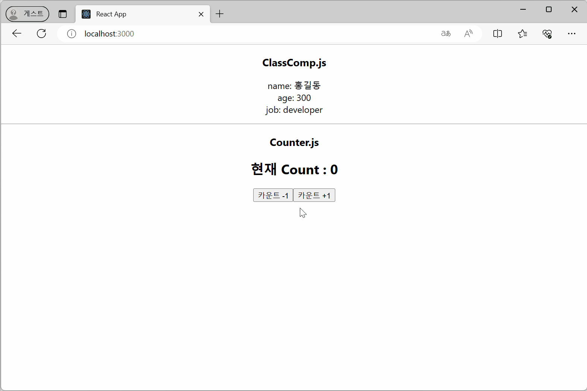
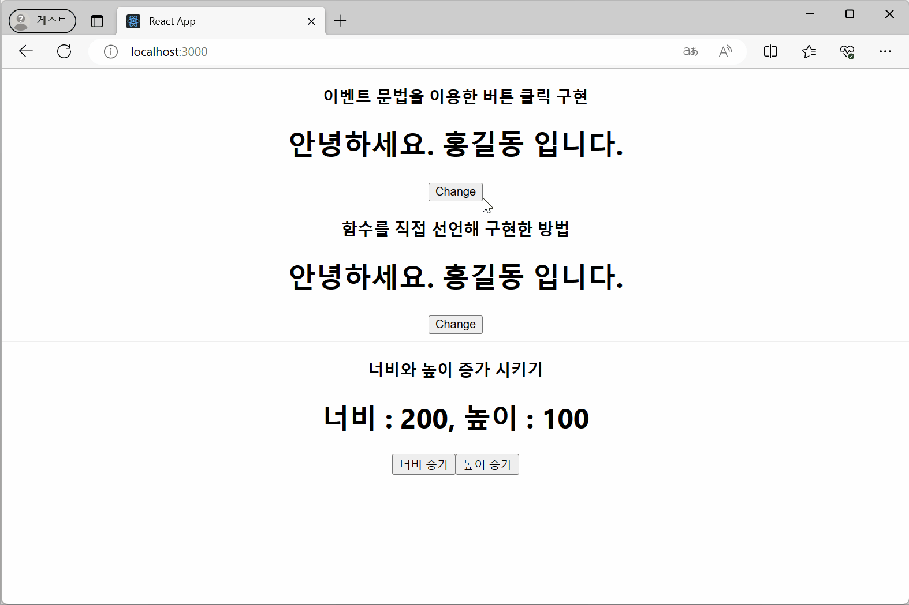
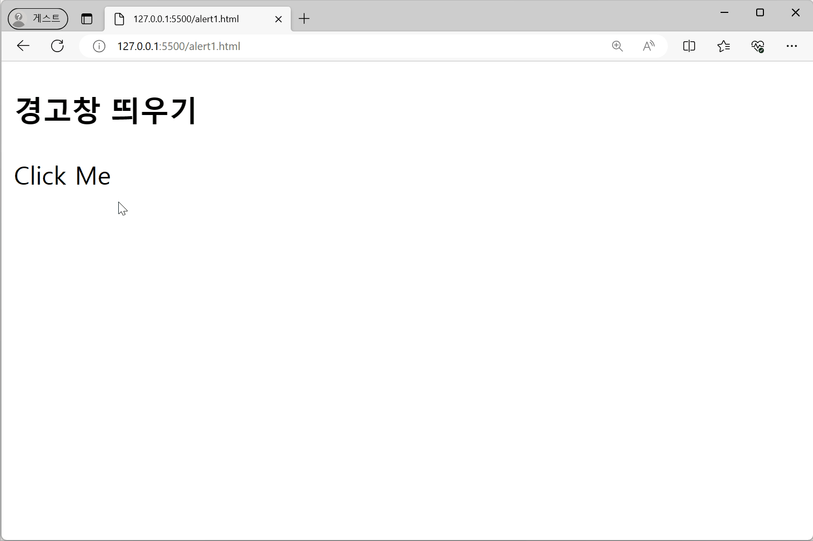
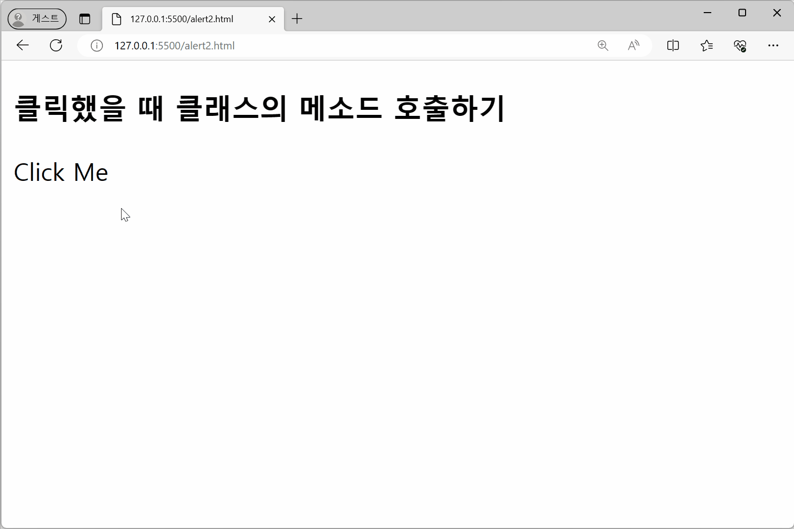
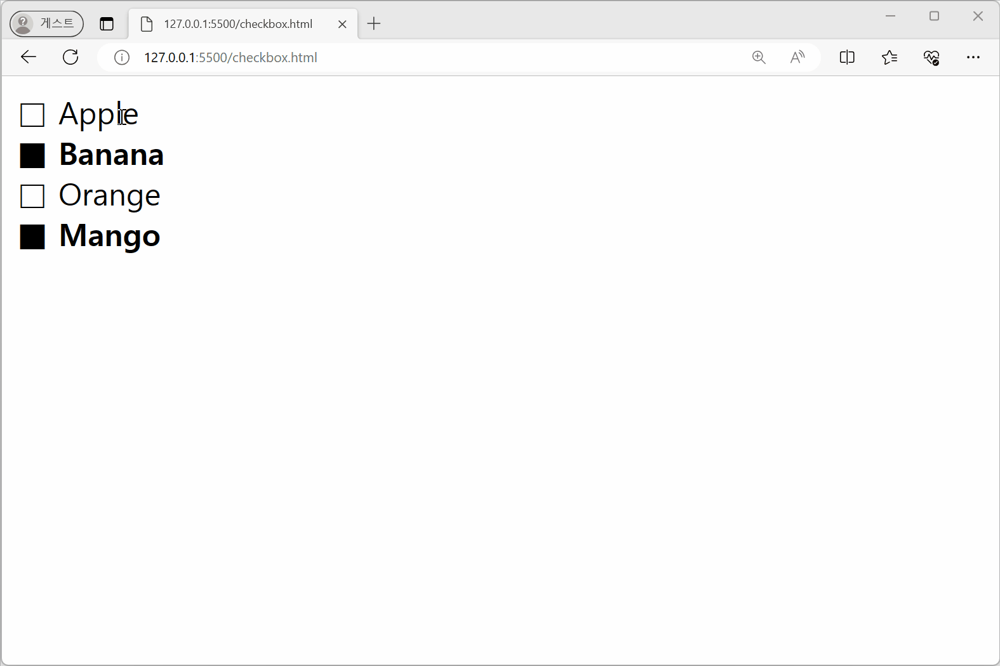
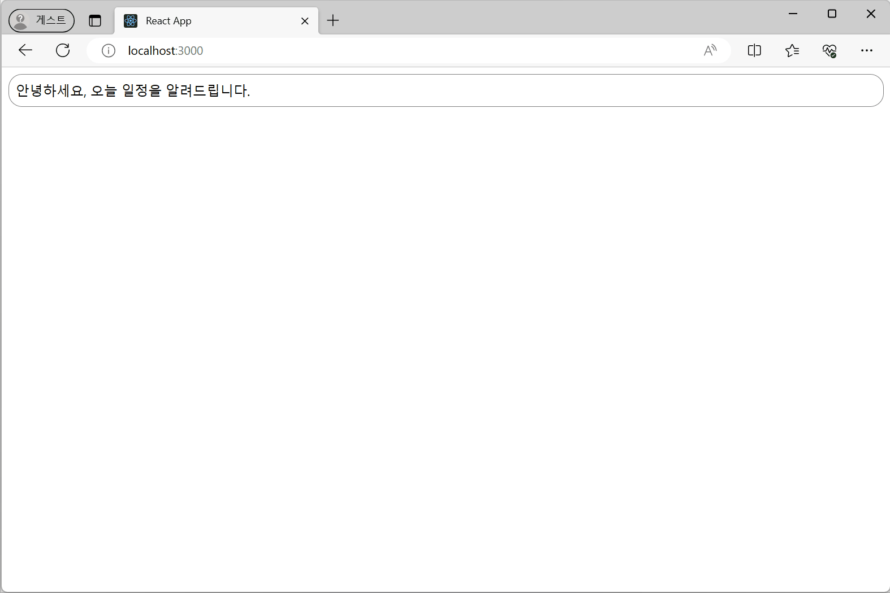
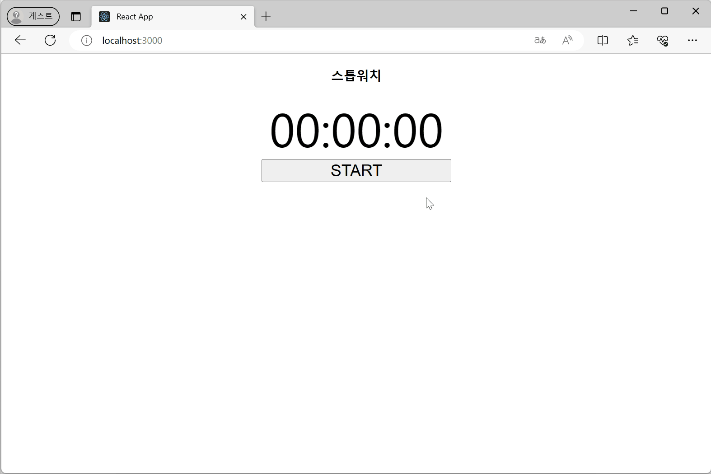
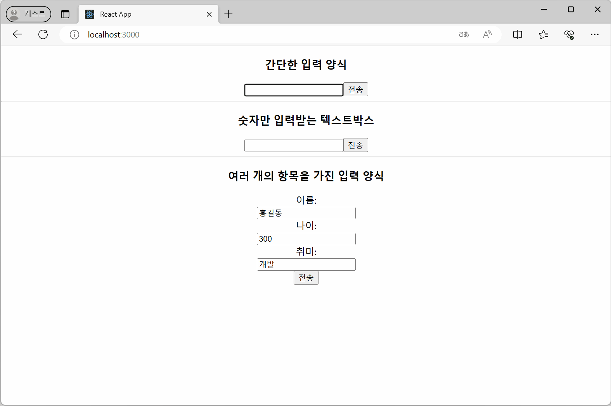

### Class Component의 State 설정 및 사용
- state 출력
- 증감 counter

🔗 Link

### Event handling
- 버튼 클릭
- state 증감

🔗 Link

### 경고창 띄우기
🔗 Link

### 클릭 시 클래스의 메서드 호출하기
🔗 Link

### 체크박스 구현
🔗 Link

### Life Cycle 확인하기
🔗 Link

### Life Cycle 확인하기 2
🔗 Link

### 스톱워치 만들기 (Life Cycle)
🔗 Link

### 입력 양식 만들기
- 문자열 입력 양식
- 숫자만 입력받는 텍스트 박스
- 여러 개의 항목을 가진 입력 양식

🔗 Link

