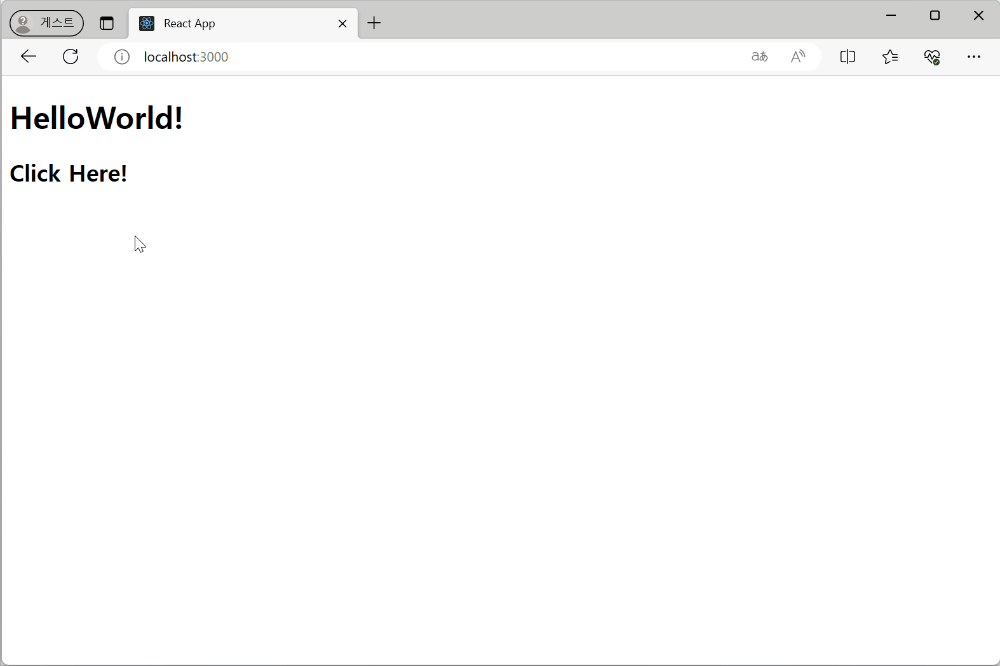

### Class Component의 State 설정 및 사용
[🔗 Link
](https://seoftbh.github.io/24-1_React/week06plus/classcomp/build/)

- state 출력
  - https://github.com/seoftbh/24-1_React/blob/a6bb1224c433e05afc24a8a9cd19188acbbb6737/week06plus/classcomp/src/ClassComp.js#L1-L22
- 증감 counter
  - https://github.com/seoftbh/24-1_React/blob/a6bb1224c433e05afc24a8a9cd19188acbbb6737/week06plus/classcomp/src/Counter.js#L1-L33

---
### Event handling
[🔗 Link
](https://seoftbh.github.io/24-1_React/week06plus/event_handling/build/)

- 버튼 클릭
  - https://github.com/seoftbh/24-1_React/blob/a6bb1224c433e05afc24a8a9cd19188acbbb6737/week06plus/event_handling/src/EventButton.js#L1-L15
  - https://github.com/seoftbh/24-1_React/blob/a6bb1224c433e05afc24a8a9cd19188acbbb6737/week06plus/event_handling/src/EventButtonFn.js#L1-L18
- state 증감
  - https://github.com/seoftbh/24-1_React/blob/a6bb1224c433e05afc24a8a9cd19188acbbb6737/week06plus/event_handling/src/Area.js#L1-L31

---
### 경고창 띄우기
[🔗 Link
](https://seoftbh.github.io/24-1_React/week06plus/eventHandlingHTML/alert1.html)

https://github.com/seoftbh/24-1_React/blob/a6bb1224c433e05afc24a8a9cd19188acbbb6737/week06plus/eventHandlingHTML/alert1.html#L12-L32

### 클릭 시 클래스의 메서드 호출하기
[🔗 Link
](https://seoftbh.github.io/24-1_React/week06plus/eventHandlingHTML/alert2.html)

https://github.com/seoftbh/24-1_React/blob/a6bb1224c433e05afc24a8a9cd19188acbbb6737/week06plus/eventHandlingHTML/alert2.html#L12-L33

### 체크박스 구현
[🔗 Link
](https://seoftbh.github.io/24-1_React/week06plus/eventHandlingHTML/checkbox.html)

https://github.com/seoftbh/24-1_React/blob/a6bb1224c433e05afc24a8a9cd19188acbbb6737/week06plus/eventHandlingHTML/checkbox.html#L12-L54

---
### Life Cycle 확인하기
[🔗 Link
](https://seoftbh.github.io/24-1_React/week06plus/lifecycle/build/)

https://github.com/seoftbh/24-1_React/blob/a6bb1224c433e05afc24a8a9cd19188acbbb6737/week06plus/lifecycle/src/Notification.js#L1-L40
https://github.com/seoftbh/24-1_React/blob/a6bb1224c433e05afc24a8a9cd19188acbbb6737/week06plus/lifecycle/src/NotificationList.js#L1-L63

### Life Cycle 확인하기 2
[🔗 Link
](https://seoftbh.github.io/24-1_React/week06plus/lifecycle2/build/)

https://github.com/seoftbh/24-1_React/blob/a6bb1224c433e05afc24a8a9cd19188acbbb6737/week06plus/lifecycle2/src/index.js#L1-L36

### 스톱워치 만들기 (Life Cycle)
[🔗 Link
](https://seoftbh.github.io/24-1_React/week06plus/lifecycle_stopwatch_n_forms/build-stopwatch/)

https://github.com/seoftbh/24-1_React/blob/a6bb1224c433e05afc24a8a9cd19188acbbb6737/week06plus/lifecycle_stopwatch_n_forms/src/Stopwatch.js#L1-L91

---
### 입력 양식 만들기
[🔗 Link
](https://seoftbh.github.io/24-1_React/week06plus/lifecycle_stopwatch_n_forms/build/)

- 문자열 입력 양식
  - https://github.com/seoftbh/24-1_React/blob/a6bb1224c433e05afc24a8a9cd19188acbbb6737/week06plus/lifecycle_stopwatch_n_forms/src/SimpleForm.js#L1-L32
- 숫자만 입력받는 텍스트 박스
  - https://github.com/seoftbh/24-1_React/blob/a6bb1224c433e05afc24a8a9cd19188acbbb6737/week06plus/lifecycle_stopwatch_n_forms/src/NumberForm.js#L1-L32
- 여러 개의 항목을 가진 입력 양식
  - https://github.com/seoftbh/24-1_React/blob/a6bb1224c433e05afc24a8a9cd19188acbbb6737/week06plus/lifecycle_stopwatch_n_forms/src/MultiForm.js#L1-L68
