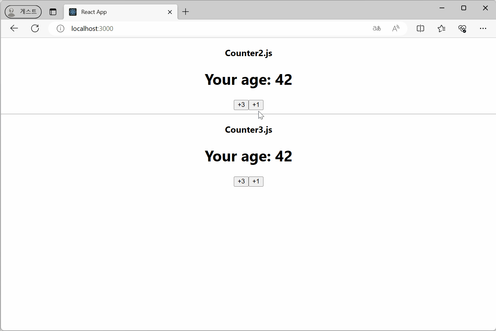
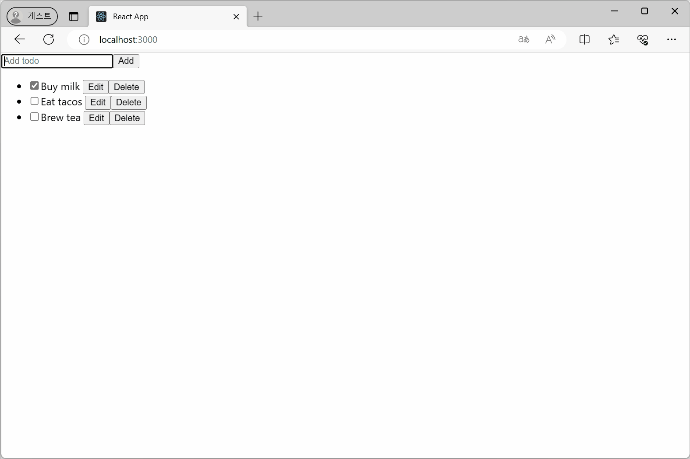
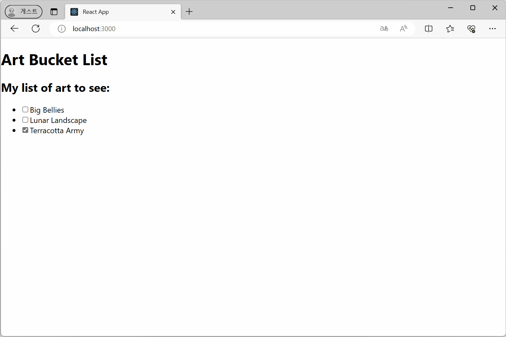
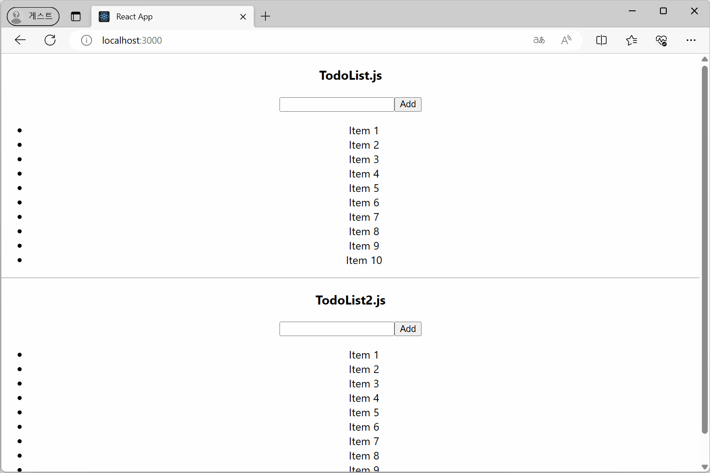
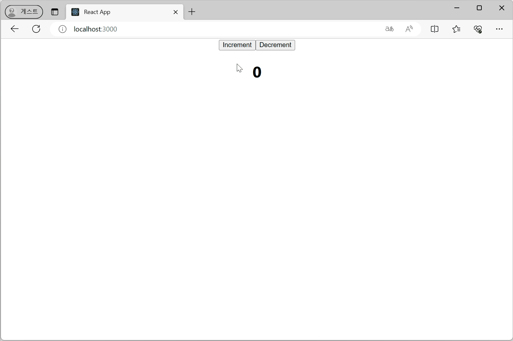

### `useState` 예제
- 카운터
- 텍스트 입력 필드
- 체크박스
- 입력 양식

🔗 Link

### 이전 상태를 기준으로 상태 업데이트
- `Counter2.js`의 `+3`은 set 함수를 3번 호출하지만 실행 중인 코드의 `age` 상태 변수가 업데이트 되지 않음
- `Counter3.js`는 updater function을 이용해 의도한 대로 3씩 증가함

🔗 Link

### 객체를 이용한 상태
🔗 Link

### 배열을 이용한 상태
🔗 Link

### `immer`라이브러리 사용
🔗 Link

### 초기 상태 패싱
- initializer 함수 패싱 
- 초기 상태를 직접 패싱
🔗 Link

### `key`로 상태 재설정
🔗 Link

### 이전 렌더링에서 정보 저장
🔗 Link

