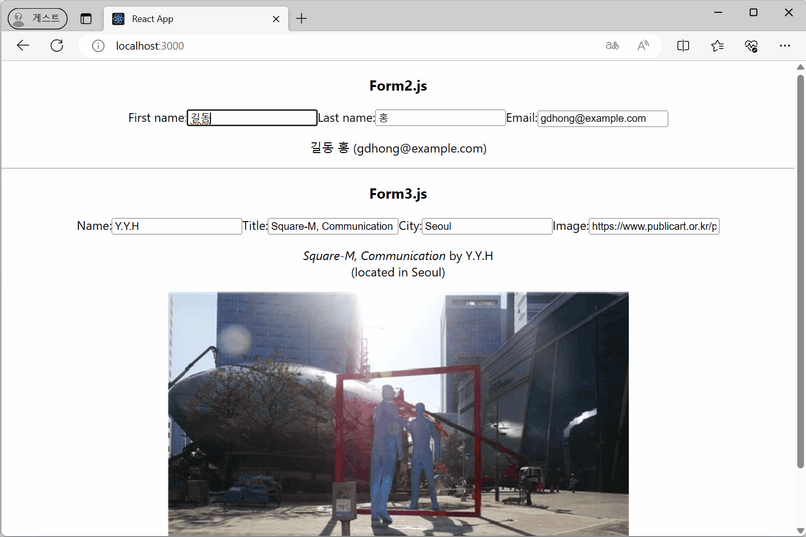

### `useState` 예제
[🔗 Link
](https://seoftbh.github.io/24-1_React/week07plus/ch06ex/build-basic_usestate_ex/)

- 카운터
  - https://github.com/seoftbh/24-1_React/blob/4b6ec0c02575a3a5ea25880203b7d00ca1a039ee/week07plus/ch06ex/src/Counter.js#L1-L9
- 텍스트 입력 필드
  - https://github.com/seoftbh/24-1_React/blob/4b6ec0c02575a3a5ea25880203b7d00ca1a039ee/week07plus/ch06ex/src/MyInput.js#L1-L14
- 체크박스
  - https://github.com/seoftbh/24-1_React/blob/4b6ec0c02575a3a5ea25880203b7d00ca1a039ee/week07plus/ch06ex/src/MyCheckbox.js#L1-L16
- 입력 양식
  - https://github.com/seoftbh/24-1_React/blob/4b6ec0c02575a3a5ea25880203b7d00ca1a039ee/week07plus/ch06ex/src/Form.js#L1-L14

---
### 이전 상태를 기준으로 상태 업데이트
[🔗 Link
](https://seoftbh.github.io/24-1_React/week07plus/ch06ex/build-usestate_counter/)

- `Counter2.js`의 `+3`은 set 함수를 3번 호출하지만 실행 중인 코드의 `age` 상태 변수가 업데이트 되지 않음
  - https://github.com/seoftbh/24-1_React/blob/10c9ab03ac3fc40d16e1133d7390aa978d33bcdd/week07plus/ch06ex/src/Counter2.js#L1-L28
- `Counter3.js`는 updater function을 이용해 의도한 대로 3씩 증가함
  - https://github.com/seoftbh/24-1_React/blob/10c9ab03ac3fc40d16e1133d7390aa978d33bcdd/week07plus/ch06ex/src/Counter3.js#L1-L28

---
### 객체를 이용한 상태
[🔗 Link
](https://seoftbh.github.io/24-1_React/week07plus/ch06ex/build/)

https://github.com/seoftbh/24-1_React/blob/10c9ab03ac3fc40d16e1133d7390aa978d33bcdd/week07plus/ch06ex/src/Form2.js#L1-L51
https://github.com/seoftbh/24-1_React/blob/10c9ab03ac3fc40d16e1133d7390aa978d33bcdd/week07plus/ch06ex/src/Form3.js#L1-L72

### 배열을 이용한 상태
[🔗 Link
](https://seoftbh.github.io/24-1_React/week07plus/todolist/build)

https://github.com/seoftbh/24-1_React/blob/10c9ab03ac3fc40d16e1133d7390aa978d33bcdd/week07plus/todolist/src/TaskList.js#L1-L56
https://github.com/seoftbh/24-1_React/blob/10c9ab03ac3fc40d16e1133d7390aa978d33bcdd/week07plus/todolist/src/AddTodo.js#L1-L22

### `immer`라이브러리 사용
[🔗 Link
](https://seoftbh.github.io/24-1_React/week07plus/immer/build/)

https://github.com/seoftbh/24-1_React/blob/10c9ab03ac3fc40d16e1133d7390aa978d33bcdd/week07plus/immer/package.json#L3-L10
https://github.com/seoftbh/24-1_React/blob/10c9ab03ac3fc40d16e1133d7390aa978d33bcdd/week07plus/immer/src/App.js#L1-L44

---
### 초기 상태 패싱
[🔗 Link](https://seoftbh.github.io/24-1_React/week07plus/ch06ex2/build-initializer_todo/)

- initializer 함수 패싱
  - https://github.com/seoftbh/24-1_React/blob/10c9ab03ac3fc40d16e1133d7390aa978d33bcdd/week07plus/ch06ex2/src/TodoList.js#L1-L39
- 초기 상태를 직접 패싱
  - https://github.com/seoftbh/24-1_React/blob/10c9ab03ac3fc40d16e1133d7390aa978d33bcdd/week07plus/ch06ex2/src/TodoList2.js#L1-L39

### `key`로 상태 재설정
[🔗 Link
](https://seoftbh.github.io/24-1_React/week07plus/ch06ex2/build-resetting_form/)

https://github.com/seoftbh/24-1_React/blob/10c9ab03ac3fc40d16e1133d7390aa978d33bcdd/week07plus/ch06ex2/src/Form.js#L1-L13

### 이전 렌더링에서 정보 저장
[🔗 Link
](https://seoftbh.github.io/24-1_React/week07plus/ch06ex2/build/)

https://github.com/seoftbh/24-1_React/blob/10c9ab03ac3fc40d16e1133d7390aa978d33bcdd/week07plus/ch06ex2/src/CountLabel.js#L1-L16
