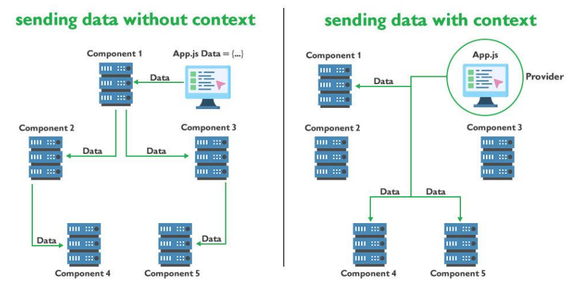

# Built-in React Hooks
---
## ToC
- [useReducer](#usereducer)
- [useContext](#usecontext)
- [useRef](#useref)
- [forwardRef](#forwardref)
- [useEffect](#useeffect)
- [useMemo](#usememo)
- [useCallback](#usecallback)
- [useDeferredValue](#usedeferredvalue)
- [useSyncExternalStore](#usesyncexternalstore)
- [Custom Hook](#custom-hook)

---
## useReducer
- `useState`를 대체할 수 있는 함수
- 복잡한 상태 로직을 관리하는 데 적합하며, `useState`보다 더 구조화된 방법을 제공
- 액션(action)에 따라 상태 업데이트 로직을 외부 함수로 분리할 수 있어서 테스트와 로직 재사용이 용이

```js
import React, { useReducer } from "react";
const [state, dispatch] = useReducer(reducer, initialState, init);
```
- `const [state, dispatch]`
	- `state` : 컴포넌트에서 사용할 상태
	- `dispatch` 함수
		- 액션을 발생시키는 함수
		- 첫번째 인자인 **reducer 함수를 실행**시킴
		- 컴포넌트 내에서 state의 업데이트를 일으키기 위해 사용하는 함수
- `useReducer(reducer, initialState, init);`
	- `reducer` 함수
		- 상태 업데이트 로직을 포함하는 함수
		- 컴포넌트 외부에서 state를 업데이트 하는 함수
		- 현재 state, action 객체를 인자로 받아, 기존의 state를 대체하여 새로운 state를 반환하는 함수
	- `initialState` : 상태(state)의 초기값
	- `init` : 초기 함수
### `dispatch` 함수
- `reducer` 함수를 실행 시킴
- 인자로 action 객체를 받음
	- action 객체: 어떤 행동을 나타내는 type 속성, 해당 행동과 관련된 데이터(payload)를 포함함
- action을 이용해 컴포넌트 내에서 state의 업데이트를 발생 시킴
#### ex)
- action type만 정의하여 사용한 예
```js
<button onClick={() => dispatch({ type: "INCREMENT" })}>증가</button>
```
- action type과, 데이터를 정의하여 사용한 예
```js
<button onClick={() => dispatch({ type: "INCREMENT", payload: 1 })}>증가</button>
```

### `reducer` 함수
- `dispatch` 함수에 의해 실행됨
- 컴포넌트 외부에서 state를 업데이트 하는 로직을 담당함
- 함수의 인자로 state와 action을 받아 새로운 state를 반환함
#### ex)
- action type만 정의하여 사용한 예
```js
function reducer(state, action) {
  switch (action.type) {
    case "INCREMENT":
      return { count: state.count + 1 };
    case "DECREMENT":
      return { count: state.count - 1 };
    default:
      throw new Error("unsupported action type: ", action.type);
  }
}

```
- action type과 데이터를 정의하여 사용한 예
```js
function reducer(state, action) {
  switch (action.type) {
    case "INCREMENT":
      return { count: state.count + action.payload };
    case "DECREMENT":
      return { count: state.count - action.payload };
    default:
      throw new Error("unsupported action type: ", action.type);
  }
}
```

---
## useContext
- 하위 컴포넌트에게 context를 제공하는 Hook
- 전역 상태를 관리할 때 유용
- 깊은 컴포넌트 트리에서도 상태를 쉽게 공유 가능
- Context로 분류한 데이터를 쉽게 받아올 수 있게 도와주는 역할
- 
> [!note] 
> ### Context
> - 앱 안에서 전역적으로 사용되는 데이터를 여러 컴포넌트끼리 쉽게 공유할 수 있는 방법을 제 공
> - Props로 데이터를 일일이 전달해 주지 않아도 해당 데이터를 가지고 있는 상위 컴포넌트에 그 데이터가 필요한 하위 컴포넌트가 접근 가능 함
> - 주로 사용자 정보, 테마, 언어 등 전역적인 데이터를 전달에 사용
> 

### 사용법
- `createContext`로 컨텍스트를 생성하고, `Provider`를 통해 상태를 공유할 컴포넌트 트리를 감싸줌
- 컨텍스트 값을 읽기 위해 `useContext` 훅과 함께 해당 컨텍스트를 사용함

```js
import React,{createContext, useContext} from 'react'

const MyContext = createContext(initialValue);
const value = useContext(MyContext);
```
- `MyContext`: 컨텍스트 객체
- `initialValue`: 컨텍스트의 초기값

---
## useRef
- `.current` 프로퍼티가 있는 (ref)객체를 반환하며, 이 객체는 컴포넌트의 전 생애주기 동안 유지됨
- 저장공간 또는 DOM요소에 접근하기 위해 사용되는 React Hook
	- DOM 노드에 접근하거나 렌더링 사이에 데이터를 유지하는 데 사용됨
- 주로 특정 DOM 요소에 접근하거나 렌더링 사이에 값을 저장할 때 사용됨

```js
import React, { useRef } from "react"
const myRef = useRef(initialValue);
```
- `myRef.current`: `initialValue`로 초기화된 값에 접근함

> [!note] 
> Ref는 reference(참조)를 의미
### 사용 예
- 변수 관리
- DOM 요소 선택

---
## forwardRef
- 부모 컴포넌트에서 자식 컴포넌트의 DOM 요소나 컴포넌트 인스턴스에 접근할 수 있게 해줌
- 함수형 컴포넌트에서 ref를 자식에게 전달할 수 있도록 해줌

### 사용하는 이유
- 함수형 컴포넌트는 인스턴스가 없기 때문에 ref 속성을 사용할 수 없음
- ↔ 클래스로 선언된 컴포넌트들은 인스턴스를 가지기 때문에 ref 속성 사용 가능

### 사용 방법
1. 부모 컴포넌트에서 useRef()를 선언하고, 자식 컴포넌트에 보냄
2. 자식 컴포넌트를 forwardRef()로 감싸고, 부모에서 사용할 함수를 useImperativeHandle()로 감쌈
3. 부모 컴포넌트에서 current 프로퍼티를 통해 함수를 사용함
```js
import { useRef } from 'react'
const ChildComponent = forwardRef((props, ref) => {
});

const ParentComponent = () => {
  const myRef = useRef();
  return <ChildComponent ref={myRef} />;
};

```


---
## useImperativeHandle
- 자식 컴포넌트가 부모 컴포넌트로부터 함수나 메서드를 노출하고 커스터마 이징할 때 사용되는 Hook
- 부모 컴포넌트는 자식 컴포넌트 내부의 특정 함수나 메서드에 직접 접근 가능해짐
- ref로 노출할 대상을 커스텀할 때 사용됨

---
## useEffect
- 리액트 컴포넌트가 렌더링 될 때마다 특정 작업을 실행할 수 있도록 하는 Hook
- 클린업(cleanup)
	- 컴포넌트가 사라지기 전이나 업데이트 되기 직전에 필요한 작업을 수행하기 위해 제공되는 기능
- 함수형 컴포넌트에서도 생명주기 메서드를 사용할 수 있게 해줌


```js
useEffect(function, deps)
```
- `function` : 수행하고자 하는 작업
- `deps` 
	- 배열 형태
	- 검사하고자 하는 특정 값 또는 빈 배열
	- 의존 값이 들어있는 배열
	- (dependency를 의미)

### useEffect가 처리되는 시점
- #### component가 mount 됐을 때
	- 컴포넌트가 화면에 처음 렌더링 되었을 때
	- `deps`에 빈 배열을 넣는 경우
		- 컴포넌트가 화면에 처음 렌더링 될 때 한 번만 실행됨
	- 배열을 생략한 경우
		- 리렌더링 될 때마다 실행됨
- #### component가 unmount 됐을 떄
	- 컴포넌트가 사라질 때 실행
- #### component가 update 됐을 때
	- 특정 값(props, sate)이 업데이트 될 때마다 실행

### cleanup 함수
- return 뒤에 나오는 함수
- useEffect에 대한 뒷정리 함수
- 메모리 누수를 방지하기 위해, useEffect 내에서 시작된 모든 작업은 컴포넌트가 언마운트 될 때 정리하는 것

### useEffect 사용 시 주의사항
- 무한 루프에 빠지지 않도록 의존성 배열을 올바르게 관리해야함
- useEffect 내부에서 상태를 변경할 때는 해당 상태가 의존성 배열에 포함되어 있는 지 확인해야 함

### useEffect 사용 방식
- 무한 반복
	- 재렌더링마다 실행
- 처음에만 실행
	- 두번째 인자를 빈 배열로 전달하게 되면, 리액트는 최초 렌더링될 때만 useEffect를 실행함
- 의존성 배열 사용
	- useEffect의 두 번째 인자인 배열
	- 의존성 배열에 존재하는 데이터가 변경될 때만 실행
- cleanup

---
## useLayoutEffect
- `useEffect`의 깜빡임 현상을 해결함
	- useEffect는 컴포넌트들이 render와 paint된 후에 실행됨
		- 비동기적(asynchronous)
- 컴포넌트들이 render된 후 실행되고, 이후에 paint가 됨
	- 렌더링 후 layout과 paint 전 동기적(synchronous)으로 실행됨
- 렌더링할 상태(state)가 Effect내에서 초기화 되어야 할 경우에 사용
- `useEffect`와 Hook의 형태가 동일함


---
## useInsertionEffect
- React 18에서 추가된 Hook
- CSS-in-JS 방식의 라이브러리에 사용됨
- DOM 업데이트 이전에 호출되는 `useEffect`의 한 형태
	- client-side에서만 실행됨

---

## useMemo
- 동일한 값을 리턴하는 함수를 반복적으로 호출하는 경우에 사용
- 맨 처음 값을 메모리에 저장(캐싱) 해 필요시 꺼내서 사용함

> [!note] 
> Memo는 Memoization을 의미

```js
const value = useMemo(() => {
	return calculate();
}, [item])
```
- 콜백 함수 (첫 번째 인자)
	- 메모이제이션을 해줄 값을 계산해 리턴해 주는 함수
- 의존성 배열 (두 번째 인자)
	- 배열 안의 요소의 값이 업데이트될 때만 콜백을 다시 호출해 메모이제이션된 값을 업데이트함
	- 빈 배열을 넘겨준 경우
		- 컴포넌트가 처음 마운트 되었을 때만 값을 계산함
		- 이후에는 항상 메모이제이션된 값을 꺼내와 사용함

> [!note] 
> ### 컴포넌트가 렌더링되는 조건
> - state가 변경되었을 때
> - props가 변경되었을 때
> - 부모 컴포넌트가 렌더링 되었을 때
> - forceUpdate()가 실행되었을 때

### 사용하는 이유
- 함수형 컴포넌트는 일종의 "함수"
	- 함수형 컴포넌트가 렌더링 된다는 것은 함수가 호출되는 것
	- 호출 마다 함수 내부 변수가 초기화됨
- 렌더링 마다 호출되는 것을 memoization으로 해결함
	- 무분별한 사용은 메모리 낭비를 야기함

---
## useCallback
- closure(특성)으로 인한 문제를 해결함

### JS의 closure
- JS의 함수는 closure(클로저)라는 특성으로 함수가 생성된 시점의 환경을 기억함
- 리액트에서 컴포넌트가 리렌더링될 때 생기는 일
	- 컴포넌트 내에 정의된 모든 함수들이 새로 생성됨
	- 부모 컴포넌트에서 정의된 함수가 자식 컴포넌트로 props로 전달되면 해당 함수는 새로운 참조를 가지게됨
	- 자식 컴포넌트는 props 변경으로 인식해 불필요한 리렌더링을 실행함
- `useCallback`의 인자로 전달 받은 함수를 메모이제이션(저장, 캐싱) 후 의존성 배열에 명시된 값이 변경될 때만 함수가 새로 생성됨

### 사용 방법
```js
useCallback(() => {
	return value;
}, [item])
```
- `useCallback(callback, dependencies)`
	- callback 함수 (첫 번째 인자)
		- 메모이제이션 함수
	- 의존성 배열 ( 두 번째 인자)
		- 의존성을 감지하는데 사용되는 배열
		- 값이 변경될 때마다 새로운 콜백을 생성함
		- 의존성 배열을 명시하지 않는 경우
			- 린더링 마다 동일한 콜백이 재사용됨

### useMemo와 useCallback 비교
- `useMemo`
	- 인자의 콜백 함수가 리턴하는 값을 메모이제이션함
- `useCallback`
	- 인자의 콜백 함수 그 자체를 메모이제이션함
		- 이전에 생성된 함수를 재사용해 동일한 함수 인스턴스를 반환

---
## useTransition
- UI를 차단(block)하지 않고 상태(state)를 업데이트할 수 있는 Hook
	- 상태 업데이트(setState)가 완료된 이후에 렌더링이 일어나므로 그 시간만큼 렌더 트리가 block되어 사용자(user)가 아무 동작도 할 수 없는 상태에 빠지게됨
- 컴포넌트 최상위 수준에서 호출됨
- 렌더링 시 우선순위에 따라 업데이트 할 수 있게 해줌
	- 우선순위가 낮은 상태 업데이트들을 transtion이라고 표시함
		- 우선순위 변경으로 렌더링이 오래 걸리는 컴포넌트를 피함
	- 렌더링이 오래 걸리는 컴포넌트의 block을 피할 수 있음
```js
const[isPending, startTransition] = useTransition();
```


---
## useDeferredValue
- 특정 값을 처리하는 우선순위를 낮추어 사용자 경험을 향상시키는 용도
- 값 변경이 일어날 때 다른 작업을 우선 처리하도록 해서 지 연된 결과 값을 사용
- 보통 `useState()`와 함께 사용됨
	- 인자로 사용

### useTranstion과의 차이점
- useTransition
	- 특정 함수를 마킹해 처리 우선순위를 낮춤
- useDeferredValue
	- 특정 값을 마킹해 우선순위를 낮춤

```js
const [state, setState] = useState('');
const defferredState = useDeferredValue(state);
```

---
## use
- Promise를 정의하는데 필요한 상용구 코드의 양을 줄여 데이터를 가져오는 프소세를 단순화 함
- promise를 인수로 전달해 비동기적으로 데이터 가져오기 가능
- if문 내에서 `use`로 특정 조건에 따라 조건부로 데이터를 일시 정지 가능

---
## useDebugValue
- React DevTools에서 사용자 지정 hook에 label을 추가할 수 있는 Hook
- return 값이 없음

```js
useDebugValue( value, [format] )
```
- value
	- 디버깅에 사용할 값
	- React DevTools에 보여주고 싶은 값
	- 어떤 타입이든 가능
- format (optional)
	- 옵션 객체
	- formatting 함수
	- React DevTools는 컴포넌트 검사 시 매개 변수로 받아 formatting 함수를 호출 후, formatting된 value를 return함

---
## useId
- 고유한 ID를 생성할 수 있는 Hook
	- ID가 재생성되는 문제를 해결하기 위함
	- React에서 ID를 생성하기 위해 일반적인 JS 변수를 사용하면 매번 ID가 재생성될 수 있음

---
## useSyncExternalStore
- Data Tearing 문제를 해결해주는 Hook
	- Data Tearing
		- 동시성 렌더링에서 서로 다른 시점의 데이터를 참조할 수 있는 문제
### External Store
- React 내장으로 제공하는 상태관리 API가 아닌, 자체적으로 상태관리 툴을 만들어 React Hook과 연동시킨 **상태관리 라이브러리**들
- external store들의 상태 관리 흐름은 React에서 관찰하지 않음
- 외부 저장소의 변경 사항을 "구독"할 수 있도록 도와주는 hook
- 대표적인 상태관리 라이브러리들
	- mobx
	- redux
	- recoil
	- jotai
	- xtsate
	- zustand
	- rect query
	- ...

### Hook signature
```js
useSyncExternalStore(
  subscribe: (callback) => Unsubscribe,
  getSnapshot: () => State,
  getServerSnapshot?: () => State
)
```
- `subscribe`
	- 콜백 함수를 받아 스토어에 등록하는 용도
	- 스토어의 값이 변경되면 콜백 함수가 호출됨
	- 콜백이 호출되면 `useSyncExternalStore`를 사용하는 컴포넌트를 리렌더링 됨
- `getSnapshot`
	- 컴포넌트에 필요한 현재 스토어의 데이터를 반환하는 함수
	- 스토어가 변경되지 않은 경우
		- 함수 호출마다 매번 동일한 값을 반환
	- 스토어 값이 변경된 경우
		- 이전 값과 `Object.is`로 비교 후 컴포넌트를 리렌더링함
- `getServerSnapshot` (optional)
	- server-side 렌더링 하이드레이션 중에만 사용됨
	- server-side에서도 사용되는 Hook인 경우 반드시 인자 값으로 넘겨줘야함

---
## Custom Hook
- 개발자가 직접 생성하는 Hook

### Custom Hook을 작성하기 위한 규칙
- 조건문, 반복문 등에서 호출될 수 없음, 컴포넌트 최상단에서만 호출 가능
- React 컴포넌트 함수 내에서만 호출되어야 함
- 함수 이름의 접두어는 반드시 `use`로 지정해야 함

> [!note] 
> - Hook도 함수의 일종
> - React의 Hook으로 동작하는 함수와 일반 함수를 구분하기 위한 규칙


