# ToC
- [Chap 7](#chap-7)
- [Chap 7-1](#chap-7-1)

---
# Chap 7
### useReducer
[🔗 Link
](https://seoftbh.github.io/24-1_React/week09plus/ch07ex/build-useReducer/)
[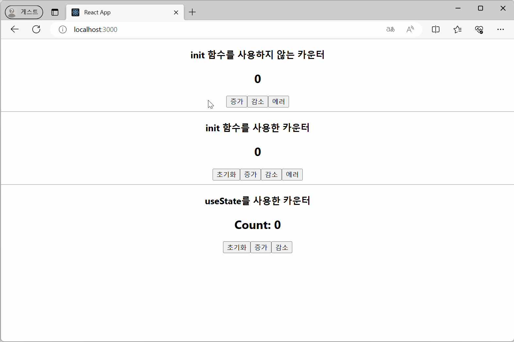](https://seoftbh.github.io/24-1_React/week09plus/ch07ex/build-useReducer/)
- init 함수를 사용하지 않는 카운터
  - https://github.com/seoftbh/24-1_React/blob/978cb865c63f451e4e7632d0254a4e4377f74482/week09plus/ch07ex/src/useReducerEx/Counter.js#L1-L30
- init 함수를 사용한 카운터
  - https://github.com/seoftbh/24-1_React/blob/978cb865c63f451e4e7632d0254a4e4377f74482/week09plus/ch07ex/src/useReducerEx/Counter_initFn.js#L1-L38
- useState를 사용한 카운터
  - https://github.com/seoftbh/24-1_React/blob/978cb865c63f451e4e7632d0254a4e4377f74482/week09plus/ch07ex/src/useReducerEx/Counter_useState.js#L1-L20

### useContext 예제 1
[🔗 Link
](https://seoftbh.github.io/24-1_React/week09plus/ch07ex/build-useContext/)
[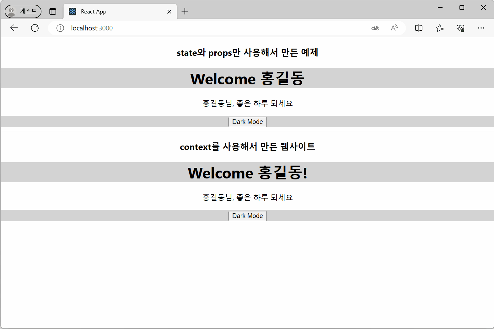](https://seoftbh.github.io/24-1_React/week09plus/ch07ex/build-useContext/)
[`PageApp.js`](./ch07ex/src/components/PageApp.js)
- state와 props만 사용해서 만든 웹사이트
  - https://github.com/seoftbh/24-1_React/blob/978cb865c63f451e4e7632d0254a4e4377f74482/week09plus/ch07ex/src/components/Page.js#L1-L14
  - https://github.com/seoftbh/24-1_React/blob/978cb865c63f451e4e7632d0254a4e4377f74482/week09plus/ch07ex/src/components/Header.js#L1-L15
  - [`Content.js`](./ch07ex/src/components/Content.js)
  - [`Footer.js`](./ch07ex/src/components/Footer.js)
- context를 사용해서 만든 웹사이트
  - https://github.com/seoftbh/24-1_React/blob/978cb865c63f451e4e7632d0254a4e4377f74482/week09plus/ch07ex/src/components/context/ThemeContext.js#L1-L3
  - https://github.com/seoftbh/24-1_React/blob/978cb865c63f451e4e7632d0254a4e4377f74482/week09plus/ch07ex/src/components/Page2.js#L1-L16
  - https://github.com/seoftbh/24-1_React/blob/978cb865c63f451e4e7632d0254a4e4377f74482/week09plus/ch07ex/src/components/Header2.js#L1-L17
  - [`Content2.js`](./ch07ex/src/components/Content2.js)
  - [`Footer2.js`](./ch07ex/src/components/Footer2.js)

### useContext 예제 2
[🔗 Link
](https://seoftbh.github.io/24-1_React/week09plus/ch07ex/build-change_context/)
[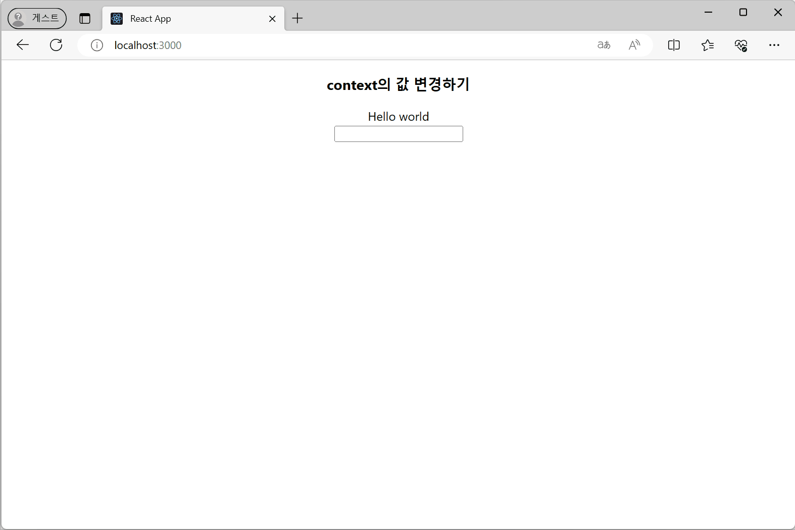](https://seoftbh.github.io/24-1_React/week09plus/ch07ex/build-change_context/)
- context의 값 변경하기
  - https://github.com/seoftbh/24-1_React/blob/978cb865c63f451e4e7632d0254a4e4377f74482/week09plus/ch07ex/src/useContextEx/ChangeContext.js#L1-L25

### useRef - 변수 관리
[🔗 Link
](https://seoftbh.github.io/24-1_React/week09plus/ch07ex/build-useRef1/)
[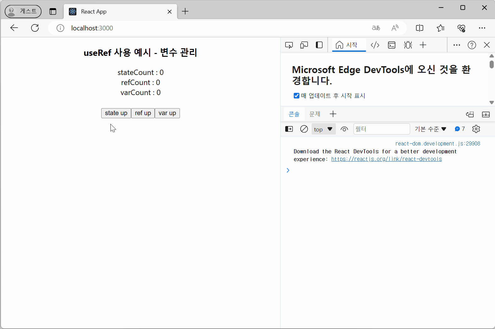](https://seoftbh.github.io/24-1_React/week09plus/ch07ex/build-useRef1/)
https://github.com/seoftbh/24-1_React/blob/978cb865c63f451e4e7632d0254a4e4377f74482/week09plus/ch07ex/src/useRefEx/CounterUseRef.js#L1-L33

### useRef - DOM 요소 선택
[🔗 Link](https://seoftbh.github.io/24-1_React/week09plus/ch07ex/build-useRef2/)
[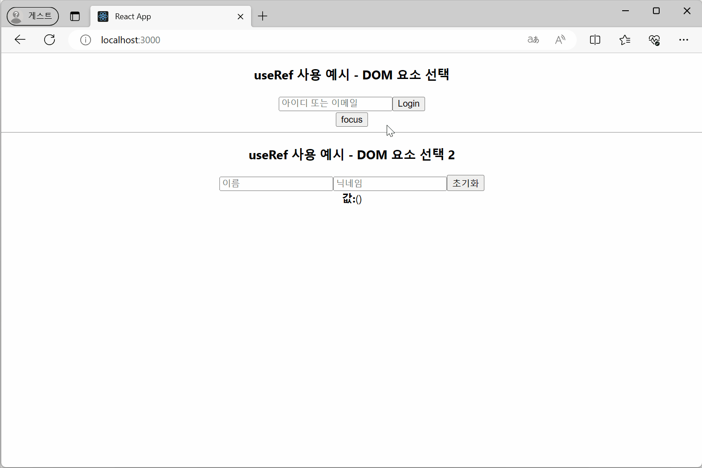](https://seoftbh.github.io/24-1_React/week09plus/ch07ex/build-useRef2/)
- DOM 요소 선택
  - https://github.com/seoftbh/24-1_React/blob/978cb865c63f451e4e7632d0254a4e4377f74482/week09plus/ch07ex/src/useRefEx/DOMFocus.js#L1-L20
- DOM 요소 선택 2
  - https://github.com/seoftbh/24-1_React/blob/978cb865c63f451e4e7632d0254a4e4377f74482/week09plus/ch07ex/src/useRefEx/InputSample.js#L1-L47

### useImperativeHandle
[🔗 Link](https://seoftbh.github.io/24-1_React/week09plus/ch07ex/build-useImperativeHandle/)
[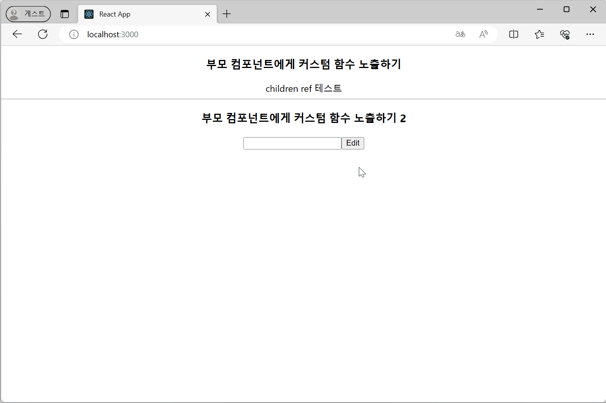](https://seoftbh.github.io/24-1_React/week09plus/ch07ex/build-useImperativeHandle/)
- 부모 컴포넌트에게 커스텀 함수 노출하기
  - https://github.com/seoftbh/24-1_React/blob/978cb865c63f451e4e7632d0254a4e4377f74482/week09plus/ch07ex/src/useImperativeHandleEx/ParentComponent.js#L1-L16
  - https://github.com/seoftbh/24-1_React/blob/978cb865c63f451e4e7632d0254a4e4377f74482/week09plus/ch07ex/src/useImperativeHandleEx/ChildComponent.js#L1-L14
- 부모 컴포넌트에게 커스텀 함수 노출하기 2
  - https://github.com/seoftbh/24-1_React/blob/978cb865c63f451e4e7632d0254a4e4377f74482/week09plus/ch07ex/src/useImperativeHandleEx/Form.js#L1-L21
  - https://github.com/seoftbh/24-1_React/blob/978cb865c63f451e4e7632d0254a4e4377f74482/week09plus/ch07ex/src/useImperativeHandleEx/MyInput.js#L1-L17

### useEffect - 기본 예제
[🔗 Link](https://seoftbh.github.io/24-1_React/week09plus/ch07ex/build-useEffect/)
[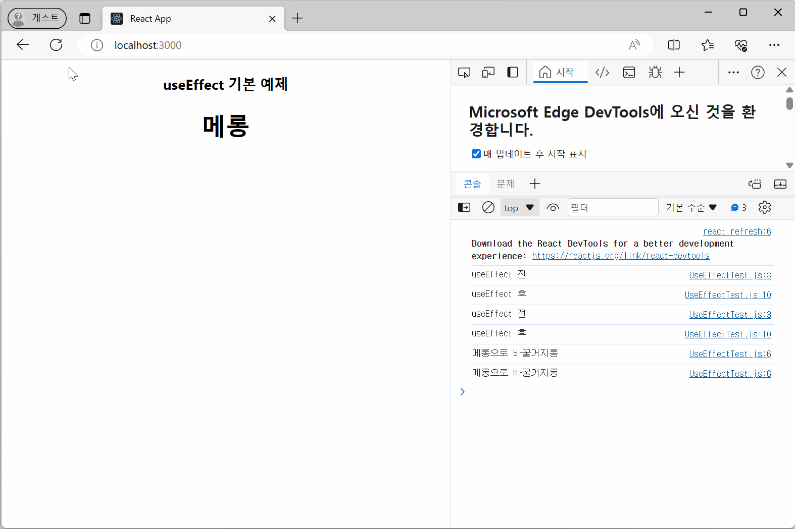](https://seoftbh.github.io/24-1_React/week09plus/ch07ex/build-useEffect/)
https://github.com/seoftbh/24-1_React/blob/978cb865c63f451e4e7632d0254a4e4377f74482/week09plus/ch07ex/src/useEffectEx/UseEffectTest.js#L1-L17

### useEffect의 세 가지 사용 방법
[🔗 Link](https://seoftbh.github.io/24-1_React/week09plus/ch07ex/build-useEffect2/)
[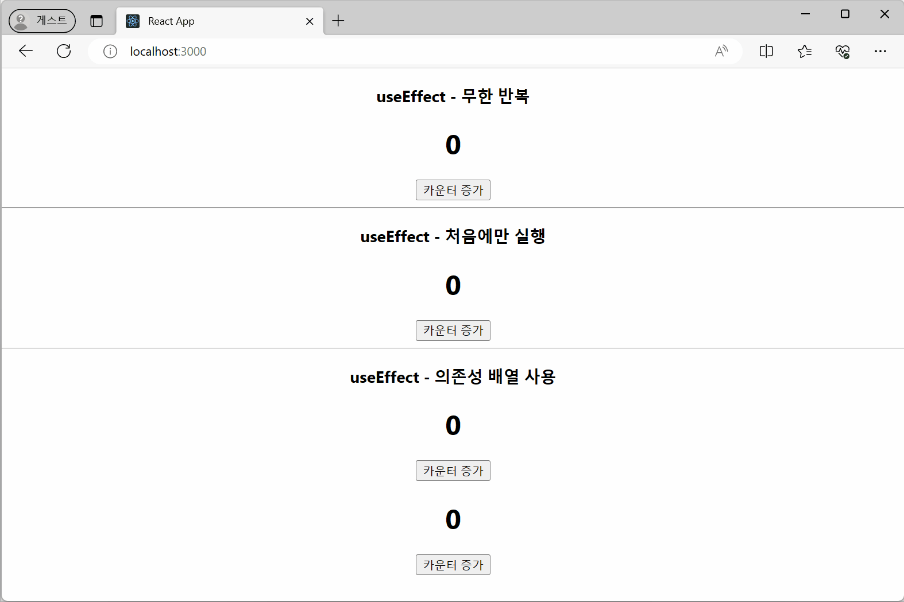](https://seoftbh.github.io/24-1_React/week09plus/ch07ex/build-useEffect2/)
- 무한 반복
  - https://github.com/seoftbh/24-1_React/blob/978cb865c63f451e4e7632d0254a4e4377f74482/week09plus/ch07ex/src/useEffectEx/UseEffectTest2.js#L1-L17
- 처음에만 실행
  - https://github.com/seoftbh/24-1_React/blob/978cb865c63f451e4e7632d0254a4e4377f74482/week09plus/ch07ex/src/useEffectEx/UseEffectTest3.js#L1-L17
- 의존성 배열 사용
  - https://github.com/seoftbh/24-1_React/blob/978cb865c63f451e4e7632d0254a4e4377f74482/week09plus/ch07ex/src/useEffectEx/UseEffectTest4.js#L1-L23

### useEffect - cleanup
[🔗 Link](https://seoftbh.github.io/24-1_React/week09plus/ch07ex/build-useEffect3/)
[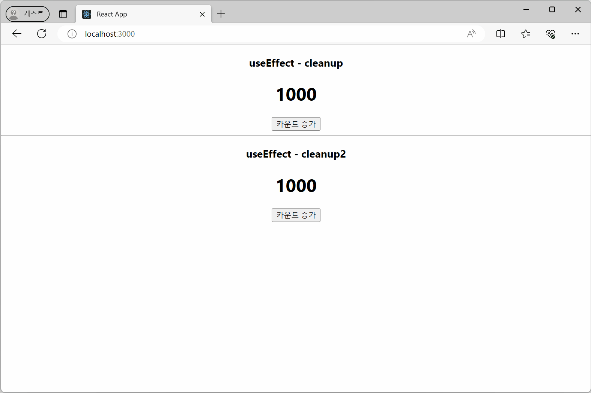](https://seoftbh.github.io/24-1_React/week09plus/ch07ex/build-useEffect3/)
- https://github.com/seoftbh/24-1_React/blob/978cb865c63f451e4e7632d0254a4e4377f74482/week09plus/ch07ex/src/useEffectEx/UseEffectTest5.js#L1-L17
- https://github.com/seoftbh/24-1_React/blob/978cb865c63f451e4e7632d0254a4e4377f74482/week09plus/ch07ex/src/useEffectEx/UseEffectTest6.js#L1-L22

### useLayoutEffect 예제 1
[🔗 Link](https://seoftbh.github.io/24-1_React/week09plus/ch07ex/build-useLayoutEffect/)
[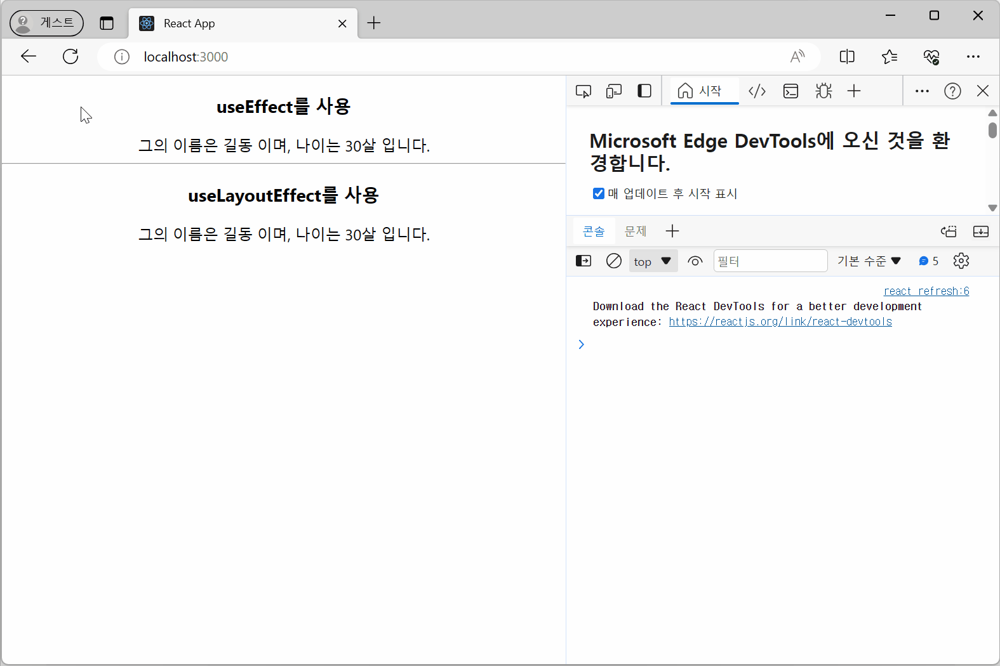](https://seoftbh.github.io/24-1_React/week09plus/ch07ex/build-useLayoutEffect/)
- useEffect를 사용
  - https://github.com/seoftbh/24-1_React/blob/978cb865c63f451e4e7632d0254a4e4377f74482/week09plus/ch07ex/src/useLayoutEffectEx/LayoutEffect.js#L1-L16
- useLayoutEffect를 사용
  - https://github.com/seoftbh/24-1_React/blob/978cb865c63f451e4e7632d0254a4e4377f74482/week09plus/ch07ex/src/useLayoutEffectEx/LayoutEffect2.js#L1-L16

### useLayoutEffect 예제 2
[🔗 Link](https://seoftbh.github.io/24-1_React/week09plus/ch07ex/build/)
[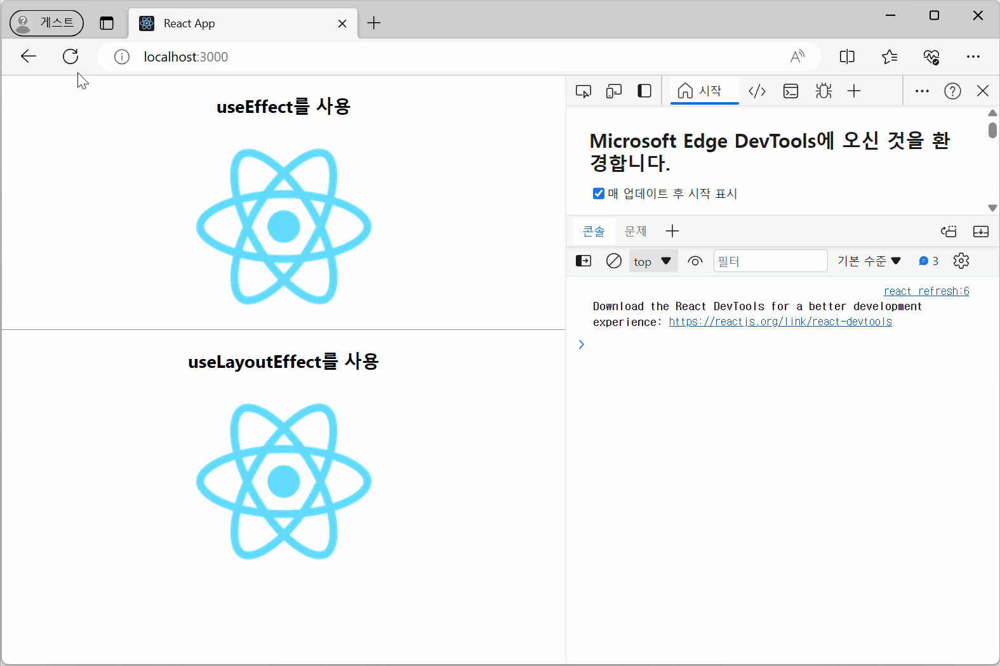](https://seoftbh.github.io/24-1_React/week09plus/ch07ex/build/)
- useEffect를 사용
  - https://github.com/seoftbh/24-1_React/blob/978cb865c63f451e4e7632d0254a4e4377f74482/week09plus/ch07ex/src/useLayoutEffectEx/Practice.js#L1-L14
- useLayoutEffect를 사용
  - https://github.com/seoftbh/24-1_React/blob/978cb865c63f451e4e7632d0254a4e4377f74482/week09plus/ch07ex/src/useLayoutEffectEx/Practice2.js#L1-L14

---
# Chap 7-1
### useMemo
[🔗 Link](https://seoftbh.github.io/24-1_React/week09plus/ch07_1ex/build-useMemo/)
[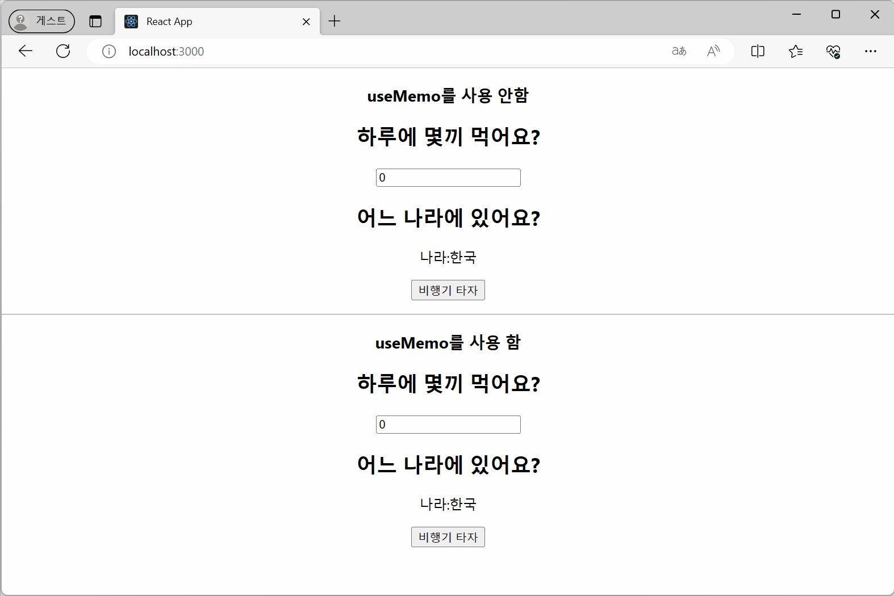](https://seoftbh.github.io/24-1_React/week09plus/ch07_1ex/build-useMemo/)
- useMemo를 사용 안함
  - https://github.com/seoftbh/24-1_React/blob/978cb865c63f451e4e7632d0254a4e4377f74482/week09plus/ch07_1ex/src/useMemoEx/Practice.js#L1-L31
- useMemo를 사용 함
  - https://github.com/seoftbh/24-1_React/blob/978cb865c63f451e4e7632d0254a4e4377f74482/week09plus/ch07_1ex/src/useMemoEx/Practice2.js#L1-L31

### useCallback
[🔗 Link](https://seoftbh.github.io/24-1_React/week09plus/ch07_1ex/build-useCallback/)
[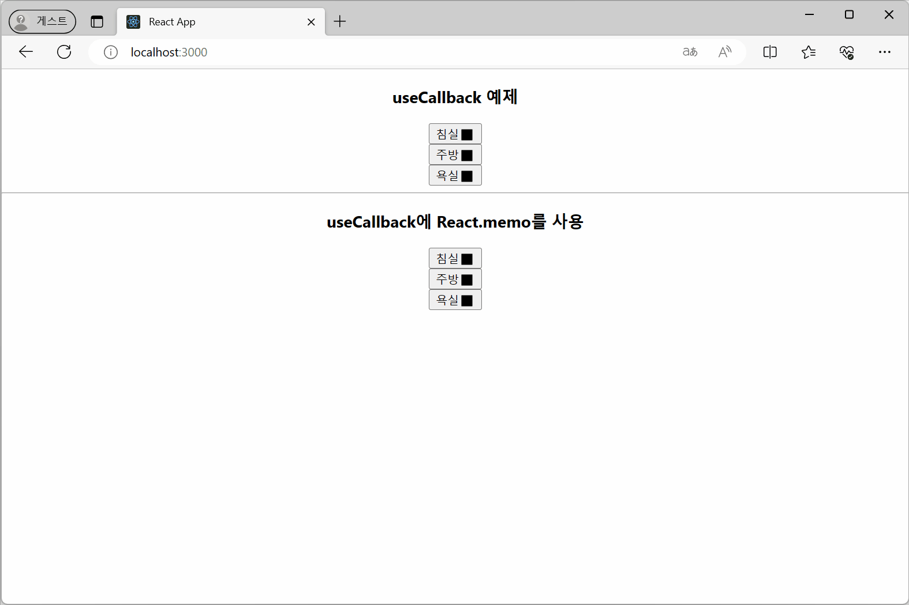](https://seoftbh.github.io/24-1_React/week09plus/ch07_1ex/build-useCallback/)
- useCallback 예제
  - https://github.com/seoftbh/24-1_React/blob/978cb865c63f451e4e7632d0254a4e4377f74482/week09plus/ch07_1ex/src/useCallbackEx/components/SmartHome.js#L1-L25
  - https://github.com/seoftbh/24-1_React/blob/978cb865c63f451e4e7632d0254a4e4377f74482/week09plus/ch07_1ex/src/useCallbackEx/components/Light.js#L1-L14
- useCallback에 React.memo를 사용
  - https://github.com/seoftbh/24-1_React/blob/978cb865c63f451e4e7632d0254a4e4377f74482/week09plus/ch07_1ex/src/useCallbackEx/components/SmartHome2.js#L1-L25
  - https://github.com/seoftbh/24-1_React/blob/978cb865c63f451e4e7632d0254a4e4377f74482/week09plus/ch07_1ex/src/useCallbackEx/components/Light2.js#L1-L14

### useTransition 예제 1
[🔗 Link](https://seoftbh.github.io/24-1_React/week09plus/ch07_1ex/build-useTransition/)
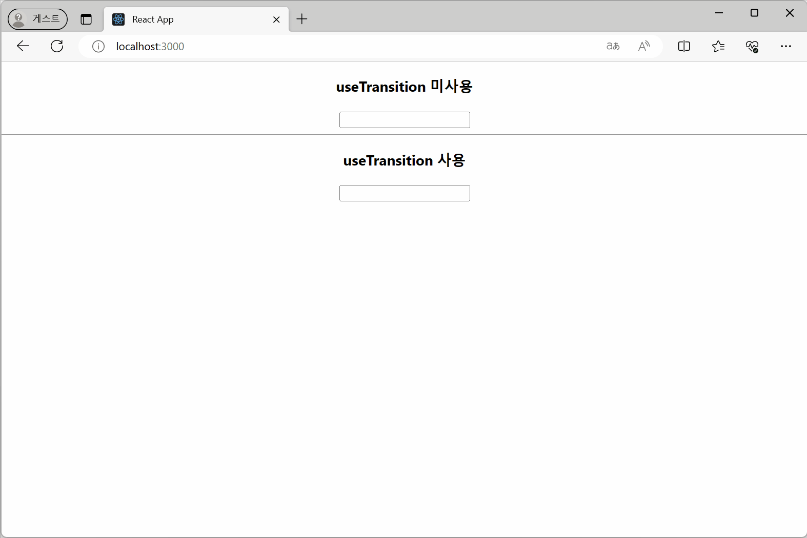
https://github.com/seoftbh/24-1_React/blob/978cb865c63f451e4e7632d0254a4e4377f74482/week09plus/ch07_1ex/src/useTransitionEx/Transition.js#L1-L20
https://github.com/seoftbh/24-1_React/blob/978cb865c63f451e4e7632d0254a4e4377f74482/week09plus/ch07_1ex/src/useTransitionEx/Transition2.js#L1-L25

### useTransition 예제 2
[🔗 Link](https://seoftbh.github.io/24-1_React/week09plus/ch07_1ex/build/)
[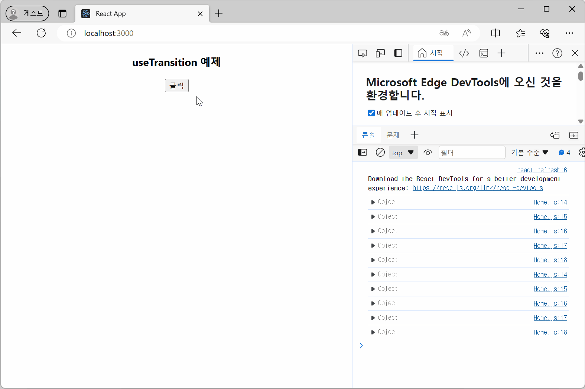](https://seoftbh.github.io/24-1_React/week09plus/ch07_1ex/build/)
https://github.com/seoftbh/24-1_React/blob/978cb865c63f451e4e7632d0254a4e4377f74482/week09plus/ch07_1ex/src/useTransitionEx/Home.js#L1-L25
